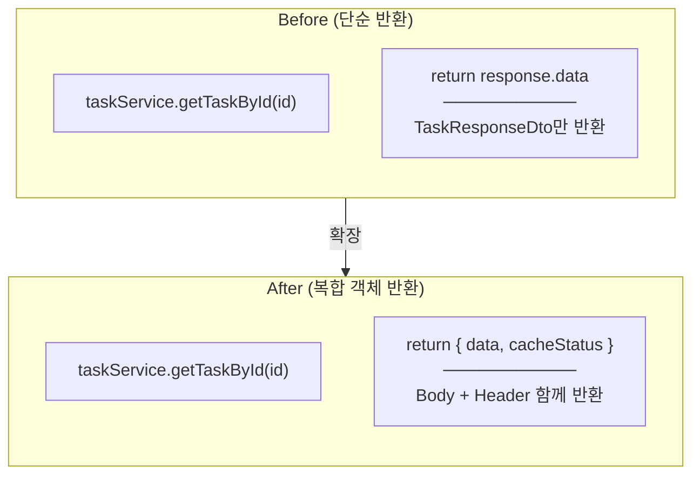
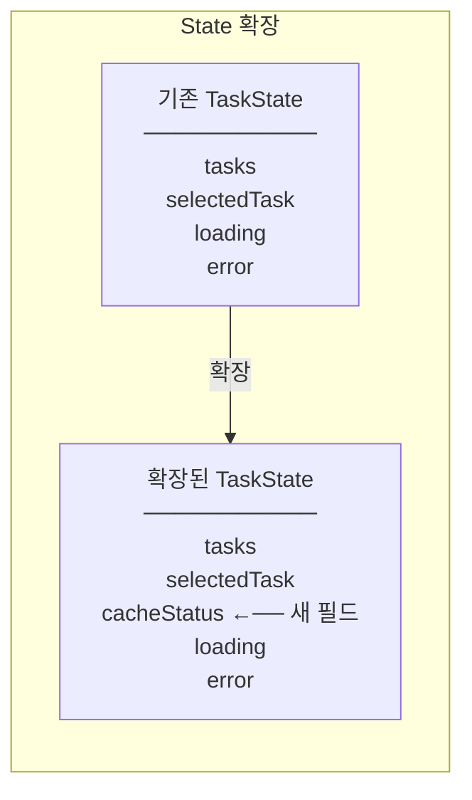
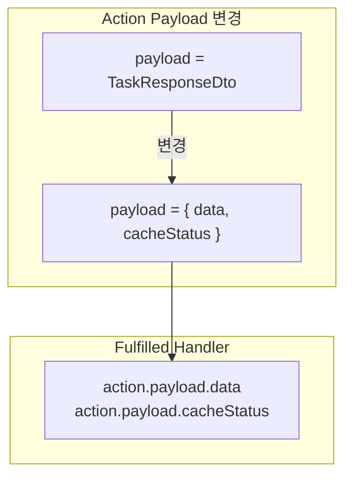
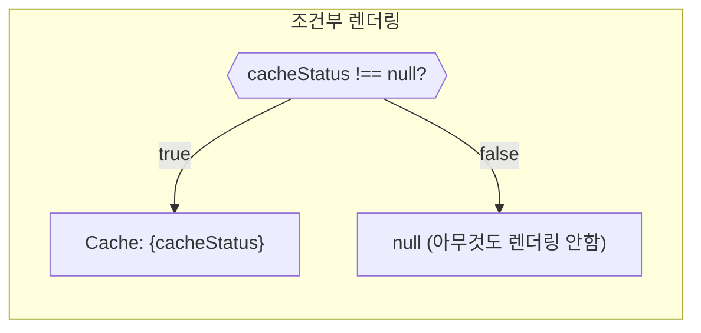
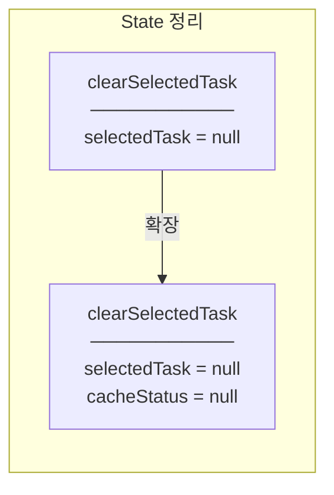
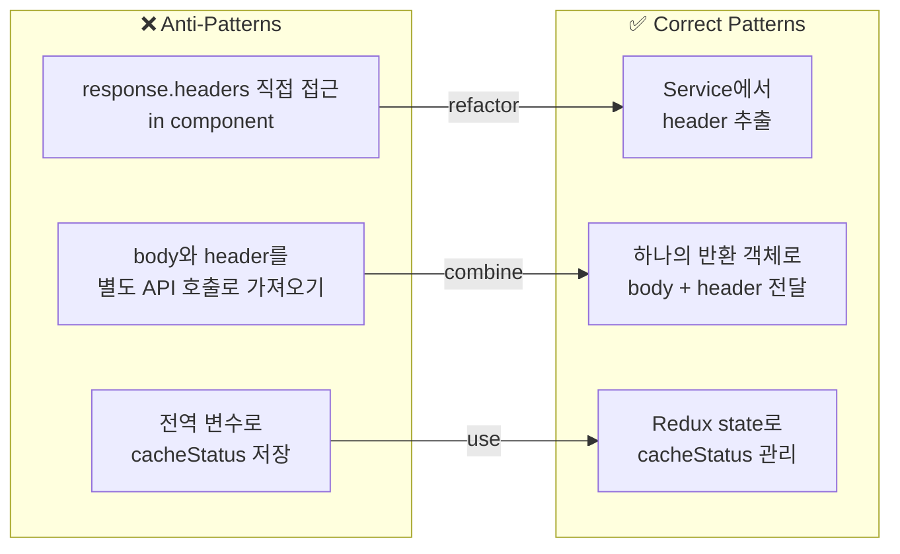
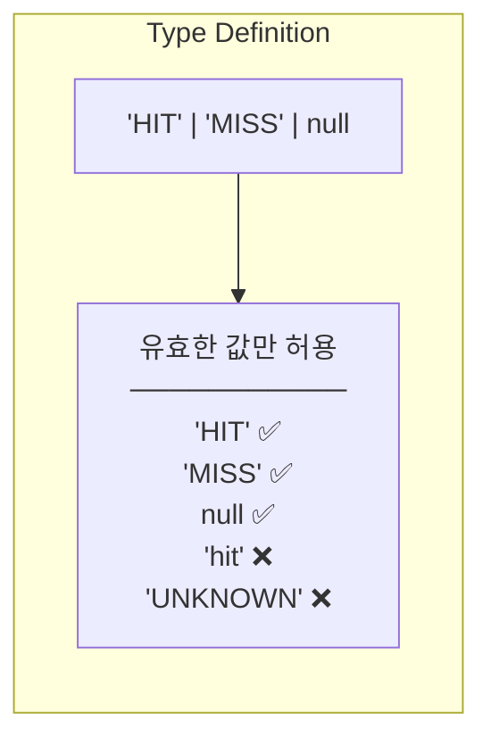

# Design Patterns

## Patterns Used

### 1. Service Layer Pattern (Response 확장)



**Implementation:**
```typescript
// Before
getTaskById: async (id: number): Promise<TaskResponseDto> => {
  const response = await api.get<TaskResponseDto>(`/tasks/${id}`);
  return response.data;
};

// After
getTaskById: async (id: number): Promise<{
  data: TaskResponseDto;
  cacheStatus: "HIT" | "MISS"
}> => {
  const response = await api.get<TaskResponseDto>(`/tasks/${id}`);
  const cacheStatus = response.headers["x-cache"] as "HIT" | "MISS" || "MISS";
  return { data: response.data, cacheStatus };
};
```

**Benefits:**
- Response body와 header 정보를 함께 전달
- Type-safe한 반환 타입
- 호출하는 쪽에서 구조 분해로 쉽게 사용

---

### 2. Redux State Extension Pattern



**Implementation:**
```typescript
// state.types.ts
export interface TaskState {
  tasks: TaskResponseDto[];
  selectedTask: TaskResponseDto | null;
  cacheStatus: "HIT" | "MISS" | null;  // 새로 추가
  loading: boolean;
  error: string | null;
}

// taskSlice.ts
const initialState: TaskState = {
  tasks: [],
  selectedTask: null,
  cacheStatus: null,  // 초기값 null
  // ...
};
```

**Benefits:**
- 기존 코드 영향 최소화
- null로 초기화하여 optional 처리
- Type system이 모든 사용처 검증

---

### 3. Payload Destructuring Pattern



**Implementation:**
```typescript
// Before
.addCase(fetchTaskById.fulfilled, (state, action) => {
  state.loading = false;
  state.selectedTask = action.payload;  // TaskResponseDto
})

// After
.addCase(fetchTaskById.fulfilled, (state, action) => {
  state.loading = false;
  state.selectedTask = action.payload.data;        // 분리
  state.cacheStatus = action.payload.cacheStatus;  // 분리
})
```

---

### 4. Conditional Rendering Pattern



**Implementation:**
```tsx
{cacheStatus && (
  <span className={`ml-2 px-2 py-0.5 rounded text-xs font-medium ${
    cacheStatus === "HIT"
      ? "bg-green-100 text-green-800"
      : "bg-yellow-100 text-yellow-800"
  }`}>
    Cache: {cacheStatus}
  </span>
)}
```

**Why `cacheStatus &&`?**
- null일 때 배지 숨김
- 로딩 중이나 에러 시 배지 표시 안함
- falsy 값 체크로 간결한 조건부 렌더링

---

### 5. Cleanup State Pattern



**Implementation:**
```typescript
// reducer
clearSelectedTask: (state) => {
  state.selectedTask = null;
  state.cacheStatus = null;  // 함께 정리
},
```

**Why clean both?**
- 연관된 상태는 함께 정리
- 다른 Task 상세 페이지로 이동 시 이전 캐시 상태 잔존 방지
- 데이터 일관성 유지

---

## Anti-Patterns Avoided



---

## Type Safety Patterns

### Union Type for cacheStatus



**Implementation:**
```typescript
// state.types.ts
cacheStatus: "HIT" | "MISS" | null;

// taskService.ts
const cacheStatus = response.headers["x-cache"] as "HIT" | "MISS" || "MISS";
```

**Benefits:**
- 컴파일 타임에 잘못된 값 체크
- 자동완성 지원
- 문서화 역할
