# Programming Concepts

## HTTP Response Header Concepts

### 1. X-Cache Custom Header

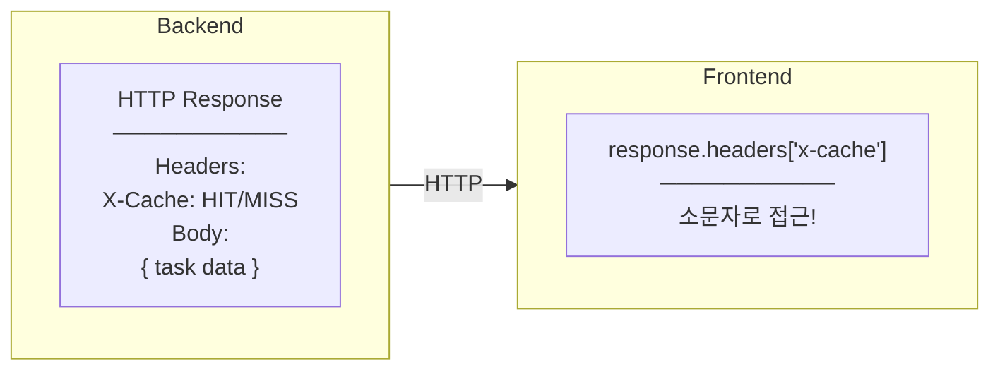

**Implementation:**
```typescript
// Backend (C#) - 대소문자 상관없이 설정
Response.Headers["X-Cache"] = cacheHit ? "HIT" : "MISS";

// Frontend (TypeScript) - 반드시 소문자로 접근
const cacheStatus = response.headers["x-cache"];
```

**Why lowercase?**
- HTTP 헤더 이름은 case-insensitive
- Axios가 모든 헤더 이름을 소문자로 정규화
- `response.headers["X-Cache"]` → undefined
- `response.headers["x-cache"]` → "HIT"

---

### 2. CORS Header Exposure

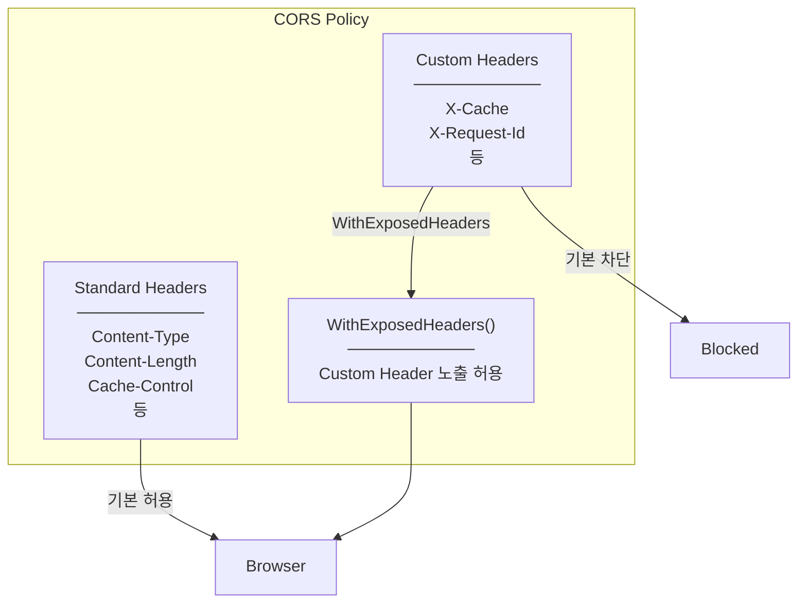

**Implementation:**
```csharp
// Program.cs
builder.Services.AddCors(options =>
{
    options.AddPolicy("AllowFrontend", policy =>
    {
        policy.WithOrigins("http://localhost:5173")
              .AllowAnyMethod()
              .AllowAnyHeader()
              .WithExposedHeaders("X-Cache");  // 핵심!
    });
});
```

**Why needed?**
- 브라우저 보안 정책으로 커스텀 헤더 기본 차단
- WithExposedHeaders로 명시적 허용 필요
- 없으면 `response.headers["x-cache"]` = undefined

---

## TypeScript Concepts

### 1. Union Type with Literal Types

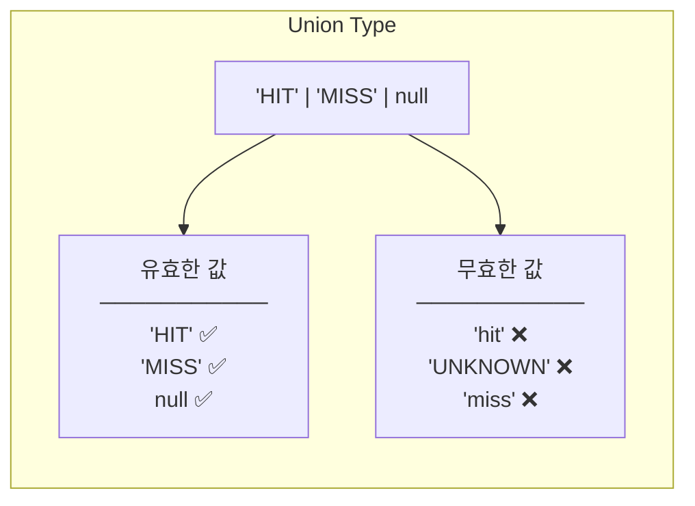

**Implementation:**
```typescript
// Type definition
cacheStatus: "HIT" | "MISS" | null;

// 컴파일 에러 예시
state.cacheStatus = "hit";      // ❌ Error: Type '"hit"' is not assignable
state.cacheStatus = "UNKNOWN";  // ❌ Error
state.cacheStatus = "HIT";      // ✅ OK
state.cacheStatus = null;       // ✅ OK
```

---

### 2. Type Assertion (as keyword)

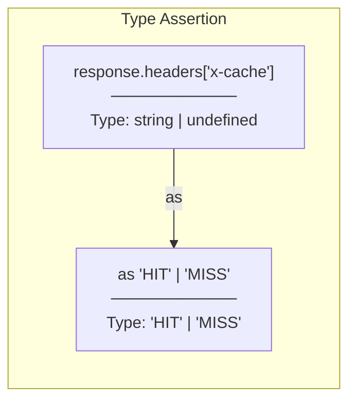

**Implementation:**
```typescript
const cacheStatus = response.headers["x-cache"] as "HIT" | "MISS" || "MISS";
```

**Why assertion?**
- `response.headers[key]`는 기본적으로 `string | undefined`
- 백엔드에서 보내는 값이 "HIT" 또는 "MISS"임을 우리가 알고 있음
- Type assertion으로 정확한 타입 지정
- `|| "MISS"`로 undefined 처리

---

### 3. Object Return Type

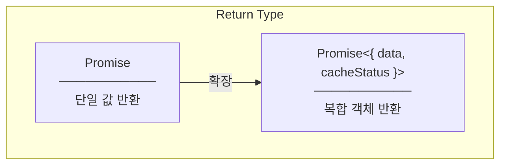

**Implementation:**
```typescript
getTaskById: async (id: number): Promise<{
  data: TaskResponseDto;
  cacheStatus: "HIT" | "MISS"
}> => {
  const response = await api.get<TaskResponseDto>(`/tasks/${id}`);
  const cacheStatus = response.headers["x-cache"] as "HIT" | "MISS" || "MISS";
  return { data: response.data, cacheStatus };
};
```

---

## Redux Toolkit Concepts

### 1. PayloadAction with Complex Type

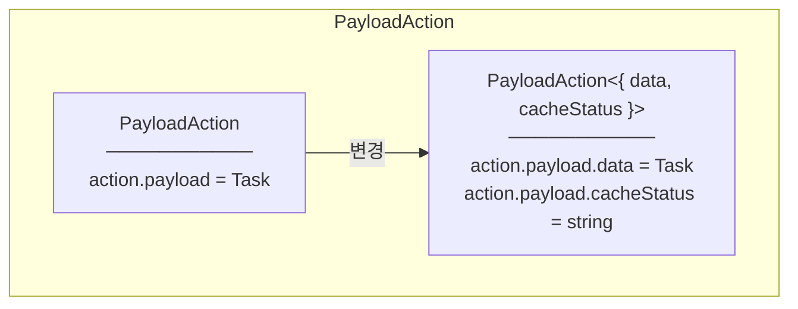

**Implementation:**
```typescript
// Before
.addCase(fetchTaskById.fulfilled, (state, action) => {
  state.selectedTask = action.payload;  // TaskResponseDto
})

// After - payload 구조 변경
.addCase(fetchTaskById.fulfilled, (state, action) => {
  state.selectedTask = action.payload.data;        // TaskResponseDto
  state.cacheStatus = action.payload.cacheStatus;  // "HIT" | "MISS"
})
```

---

### 2. Immer와 State 변경

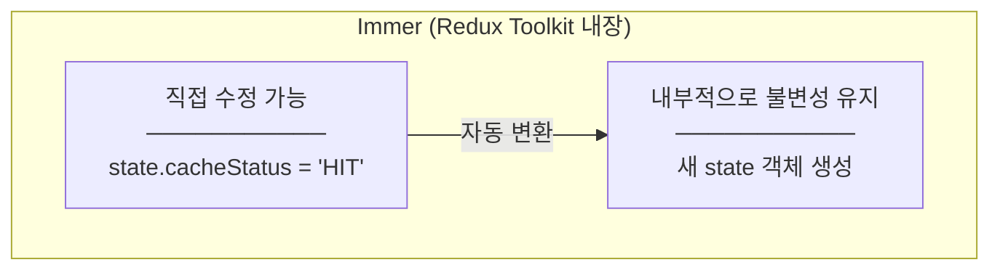

**Implementation:**
```typescript
// 이렇게 작성해도 됨 (Immer 덕분)
clearSelectedTask: (state) => {
  state.selectedTask = null;
  state.cacheStatus = null;  // 직접 수정
},
```

---

## React Concepts

### 1. React StrictMode

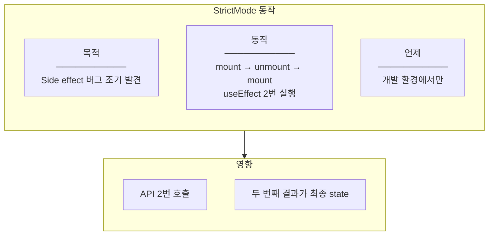

**Implementation:**
```tsx
// main.tsx
<React.StrictMode>
  <App />
</React.StrictMode>
```

**StrictMode 영향:**
- useEffect가 2번 실행됨
- 첫 번째 API 호출: MISS (캐시에 저장)
- 두 번째 API 호출: HIT (캐시에서 반환)
- UI에는 마지막 값인 HIT 표시

---

### 2. 조건부 렌더링 (Short-circuit Evaluation)

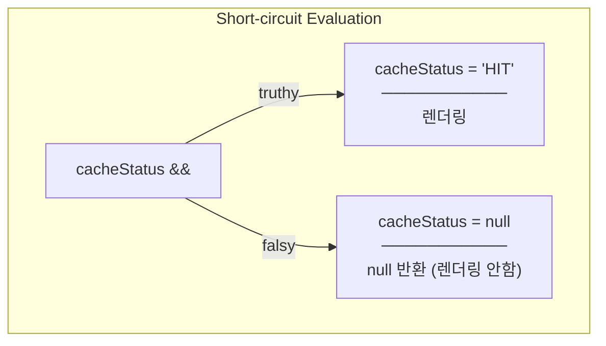

**Implementation:**
```tsx
{cacheStatus && (
  <span className="...">
    Cache: {cacheStatus}
  </span>
)}
```

**Why this pattern?**
- `null && <Component />` → null (아무것도 렌더링 안함)
- `"HIT" && <Component />` → `<Component />` 렌더링
- if문 없이 간결한 조건부 렌더링

---

### 3. Template Literal in className

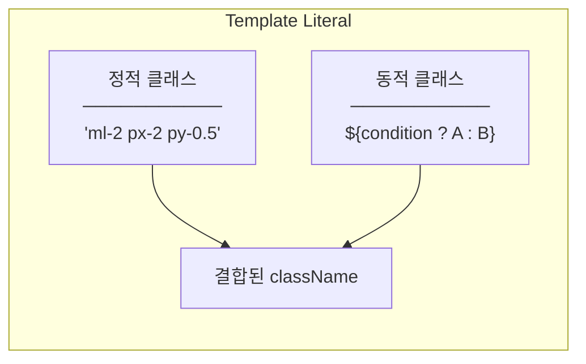

**Implementation:**
```tsx
<span
  className={`ml-2 px-2 py-0.5 rounded text-xs font-medium ${
    cacheStatus === "HIT"
      ? "bg-green-100 text-green-800"   // HIT: 초록색
      : "bg-yellow-100 text-yellow-800" // MISS: 노란색
  }`}
>
```

---

## Axios Response Concepts

### 1. Axios Response Structure

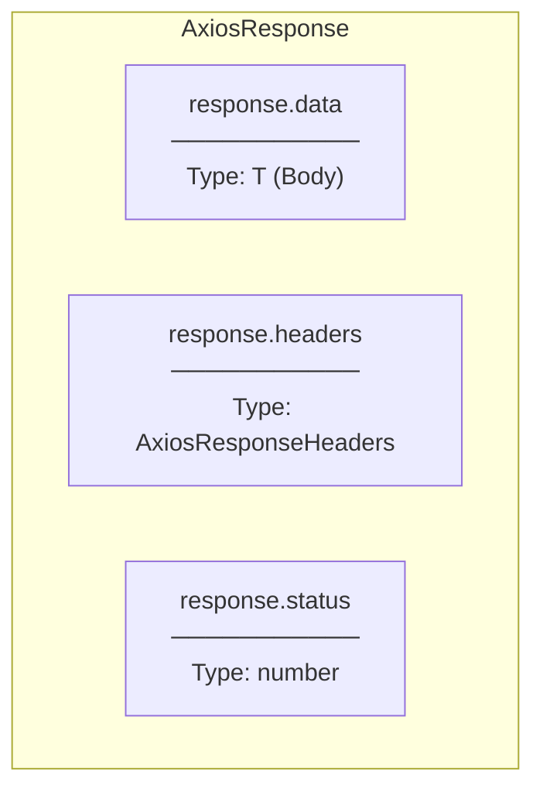

**Implementation:**
```typescript
const response = await api.get<TaskResponseDto>(`/tasks/${id}`);

// Body 접근
const task = response.data;  // TaskResponseDto

// Header 접근 (소문자!)
const cacheStatus = response.headers["x-cache"];  // string | undefined

// Status 접근
const statusCode = response.status;  // 200
```

---

## Summary Table

| 개념 | 설명 | 파일 |
|------|------|------|
| X-Cache Header | 캐시 상태 전달용 커스텀 헤더 | taskService.ts |
| WithExposedHeaders | CORS에서 커스텀 헤더 노출 허용 | Program.cs |
| Literal Union Type | "HIT" \| "MISS" \| null 타입 | state.types.ts |
| Type Assertion (as) | 타입 강제 지정 | taskService.ts |
| PayloadAction | Redux 액션 페이로드 타입 | taskSlice.ts |
| StrictMode | 개발 환경 디버깅 모드 | main.tsx |
| Short-circuit | cacheStatus && jsx 패턴 | TaskDetailsPage.tsx |
| Template Literal | 동적 className 생성 | TaskDetailsPage.tsx |
| Axios headers | 소문자로 접근 | taskService.ts |
