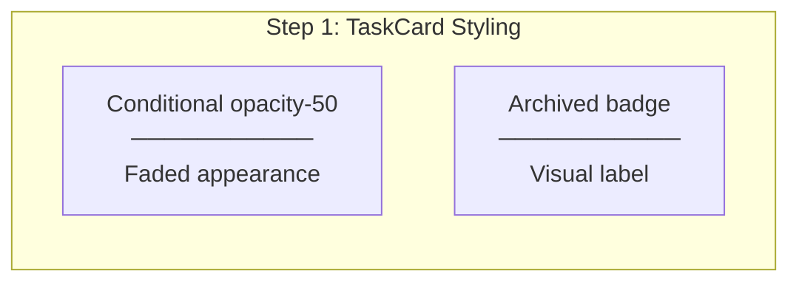
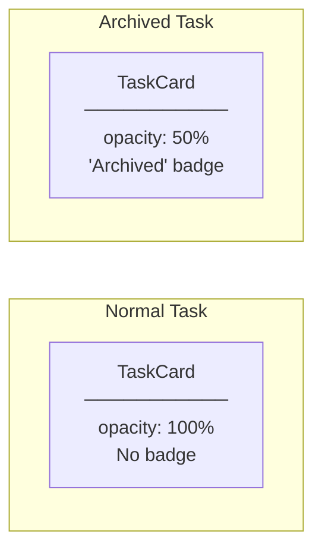
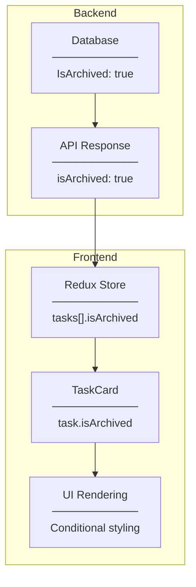

# Archived Task Visual Indicator Implementation Plan

## Overview

Task #67: Add visual indicator for archived tasks in TaskCard component.

## Implementation Flow



---

## File Implementation

### Step 1: TaskCard.tsx

**Location:** `src/features/task/components/TaskCard.tsx`

**Changes:**

#### 1.1 Conditional Opacity

**Before:**
```tsx
<div
  onClick={onClick}
  className="bg-white rounded-lg shadow-sm border border-gray-200 p-3 cursor-pointer
             hover:shadow-md hover:border-gray-300 transition-all duration-200"
>
```

**After:**
```tsx
<div
  onClick={onClick}
  className={`bg-white rounded-lg shadow-sm border border-gray-200 p-3 cursor-pointer
             hover:shadow-md hover:border-gray-300 transition-all duration-200
             ${task.isArchived ? "opacity-50" : ""}`}
>
```

---

#### 1.2 Archived Badge

**Before:**
```tsx
{/* Task ID Badge */}
<div className="flex items-center justify-between mb-2">
  <span className="text-xs font-medium text-gray-500 bg-gray-100 px-2 py-0.5 rounded">
    #{task.id}
  </span>
</div>
```

**After:**
```tsx
{/* Task ID Badge */}
<div className="flex items-center justify-between mb-2">
  <span className="text-xs font-medium text-gray-500 bg-gray-100 px-2 py-0.5 rounded">
    #{task.id}
  </span>
  {task.isArchived && (
    <span className="text-xs font-medium text-gray-600 bg-gray-100 px-2 py-0.5 rounded">
      Archived
    </span>
  )}
</div>
```

---

## Visual Comparison



---

## Data Flow



---

## Checklist

- [x] Add conditional opacity-50 class for archived tasks
- [x] Add "Archived" badge when task.isArchived is true
- [x] Build verification
