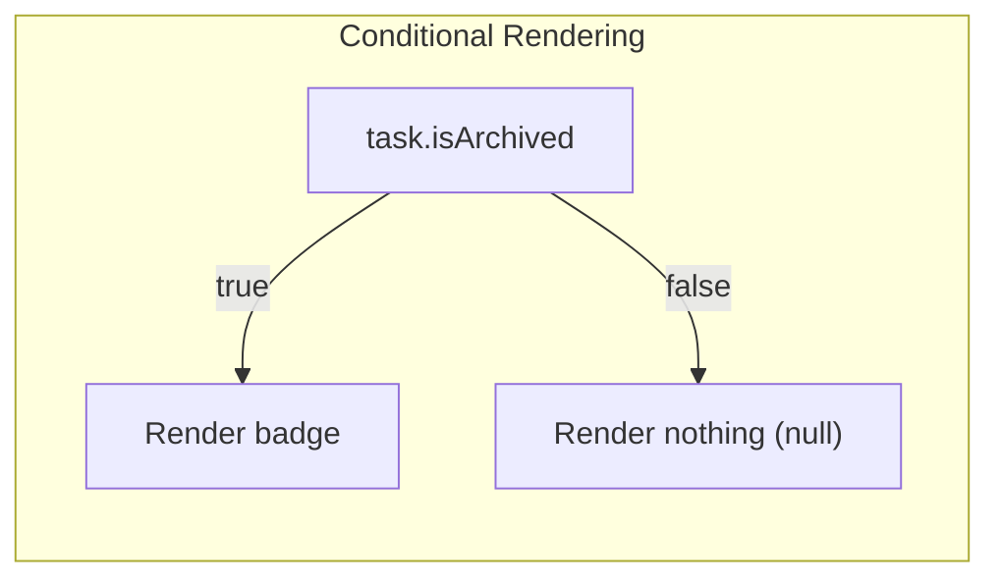
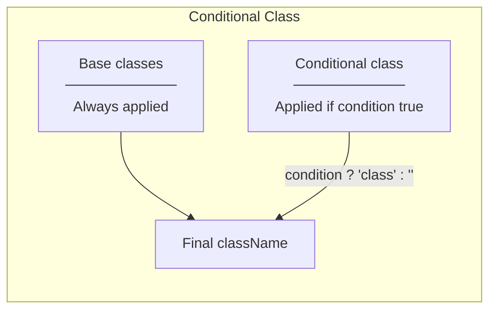
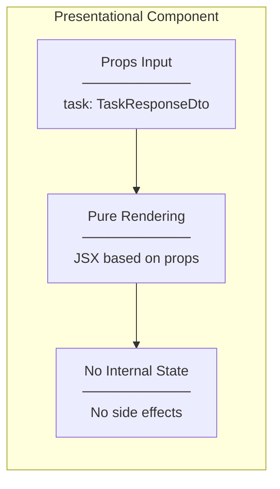
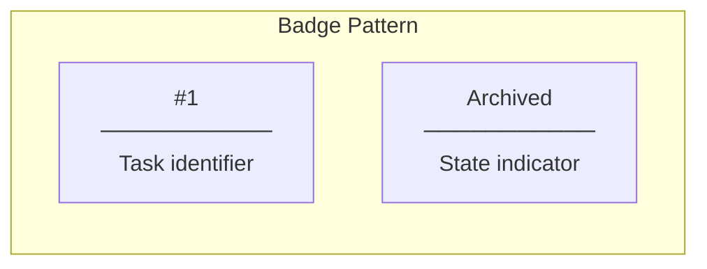
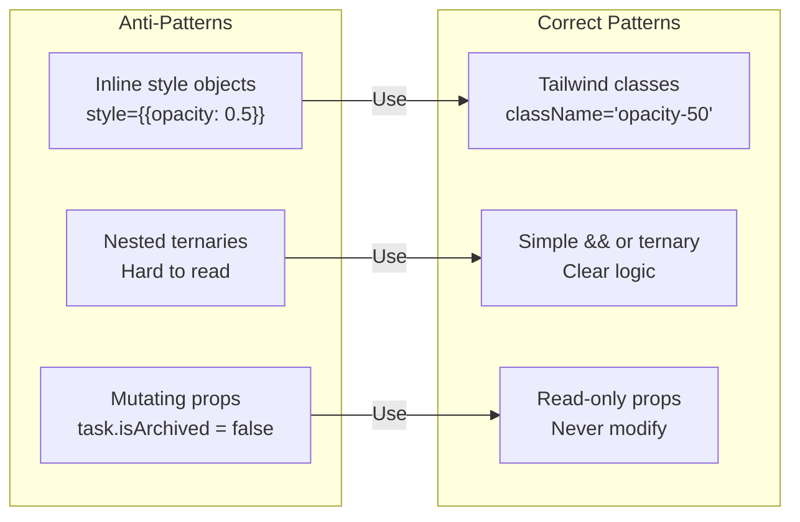

# Design Patterns

## Patterns Used

### 1. Conditional Rendering Pattern



**Implementation:**
```tsx
{task.isArchived && (
  <span className="text-xs font-medium text-gray-600 bg-gray-100 px-2 py-0.5 rounded">
    Archived
  </span>
)}
```

**Pattern Explanation:**
- `condition && <Component />` - Short-circuit evaluation
- If `task.isArchived` is false → returns false (renders nothing)
- If `task.isArchived` is true → returns JSX element

---

### 2. Conditional Class Pattern (Template Literal)



**Implementation:**
```tsx
className={`bg-white rounded-lg shadow-sm border border-gray-200 p-3 cursor-pointer
           hover:shadow-md hover:border-gray-300 transition-all duration-200
           ${task.isArchived ? "opacity-50" : ""}`}
```

**Pattern Breakdown:**
| Part | Description |
|------|-------------|
| Backticks `` ` `` | Template literal for string interpolation |
| `${...}` | JavaScript expression insertion |
| `condition ? "class" : ""` | Ternary for conditional class |

---

### 3. Presentational Component Pattern



**TaskCard Characteristics:**
- Receives `task` and `onClick` as props
- Renders UI based solely on props
- No `useState`, no `useEffect`
- Pure function of props → JSX

---

### 4. Badge UI Pattern



**Consistent Styling:**
```tsx
// Task ID Badge
<span className="text-xs font-medium text-gray-500 bg-gray-100 px-2 py-0.5 rounded">
  #{task.id}
</span>

// Archived Badge (same base style)
<span className="text-xs font-medium text-gray-600 bg-gray-100 px-2 py-0.5 rounded">
  Archived
</span>
```

**Shared Styles:**
| Class | Purpose |
|-------|---------|
| `text-xs` | Small font size |
| `font-medium` | Medium weight |
| `bg-gray-100` | Light gray background |
| `px-2 py-0.5` | Horizontal/vertical padding |
| `rounded` | Rounded corners |

---

## Anti-Patterns Avoided


