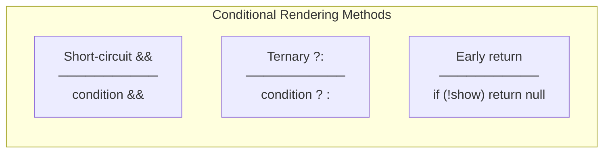
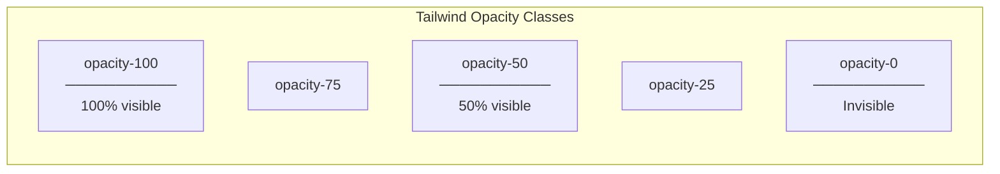
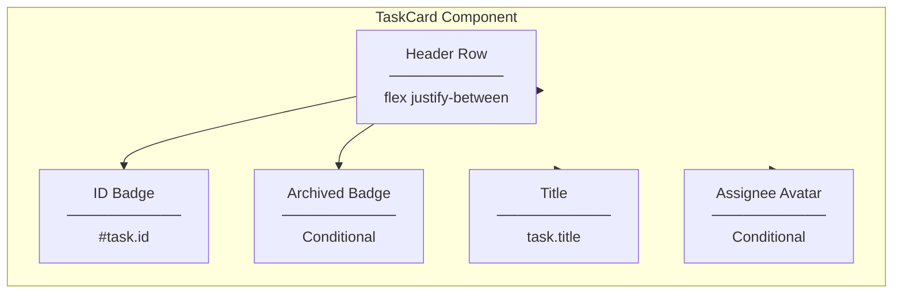

# Programming Concepts

## React Concepts

### 1. JSX Conditional Rendering



**Short-circuit (Used in TaskCard):**
```tsx
{task.isArchived && (
  <span>Archived</span>
)}
```

**How it works:**
- JavaScript `&&` returns right operand if left is truthy
- `false && <span>` → returns `false` (React ignores)
- `true && <span>` → returns `<span>` (React renders)

---

### 2. Template Literal in className

```tsx
className={`base-class ${condition ? "conditional-class" : ""}`}
```

**Breakdown:**
| Syntax | Meaning |
|--------|---------|
| `` ` `` | Template literal start/end |
| `${...}` | Expression interpolation |
| `? :` | Ternary operator |
| `""` | Empty string (no class added) |

**Example:**
```tsx
// If task.isArchived is true:
className="bg-white ... opacity-50"

// If task.isArchived is false:
className="bg-white ... "  // No extra class
```

---

### 3. Props Destructuring

```tsx
// Component signature
export const TaskCard = ({ task, onClick }: TaskCardProps) => {
  // task and onClick are destructured from props
```

**Equivalent to:**
```tsx
export const TaskCard = (props: TaskCardProps) => {
  const task = props.task;
  const onClick = props.onClick;
```

**Benefits:**
- Cleaner code
- Direct access to prop values
- TypeScript type inference

---

## Tailwind CSS Concepts

### 4. Opacity Utility Class



**CSS Generated:**
```css
.opacity-50 {
  opacity: 0.5;
}
```

**Why opacity-50?**
- Subtle visual distinction
- Still readable
- Indicates "inactive" state
- Consistent with disabled/archived patterns

---

### 5. Flexbox Layout Classes

```tsx
<div className="flex items-center justify-between mb-2">
```

| Class | CSS | Purpose |
|-------|-----|---------|
| `flex` | `display: flex` | Enable flexbox |
| `items-center` | `align-items: center` | Vertical center |
| `justify-between` | `justify-content: space-between` | Push items to edges |
| `mb-2` | `margin-bottom: 0.5rem` | Bottom spacing |

**Result:**
```
[#1]                    [Archived]
 ↑                          ↑
Left edge              Right edge
```

---

### 6. Text and Background Color Classes

```tsx
<span className="text-xs font-medium text-gray-600 bg-gray-100 px-2 py-0.5 rounded">
```

| Class | Purpose |
|-------|---------|
| `text-xs` | Extra small font size (0.75rem) |
| `font-medium` | Medium font weight (500) |
| `text-gray-600` | Dark gray text color |
| `bg-gray-100` | Light gray background |
| `px-2` | Horizontal padding (0.5rem) |
| `py-0.5` | Vertical padding (0.125rem) |
| `rounded` | Border radius (0.25rem) |

---

## TypeScript Concepts

### 7. Type from API Response

```tsx
interface TaskCardProps {
  task: TaskResponseDto;  // Type from API types
  onClick: () => void;
}
```

**TaskResponseDto includes:**
```typescript
interface TaskResponseDto {
  id: number;
  title: string;
  description: string | null;
  status: TaskStatus;
  isArchived: boolean;     // ← Used for conditional styling
  archivedAt: string | null;
  // ... other fields
}
```

**Type Safety:**
- `task.isArchived` is known to be `boolean`
- TypeScript ensures property exists
- IDE autocomplete works

---

### 8. Boolean Type Coercion

```tsx
{task.isArchived && (
  <span>Archived</span>
)}
```

**Type Safety:**
- `task.isArchived` is `boolean` (not `boolean | undefined`)
- No need for extra null checks
- Clean conditional rendering

**If it were optional:**
```tsx
// If isArchived?: boolean (optional)
{task.isArchived === true && (
  <span>Archived</span>
)}
// More explicit check needed
```

---

## Component Composition

### 9. Badge Composition



**Visual Layout:**
```
┌─────────────────────────────┐
│ #1                 Archived │  ← Header row
├─────────────────────────────┤
│ Task Title Here             │  ← Title
│ (up to 2 lines)             │
├─────────────────────────────┤
│                         [JD]│  ← Assignee avatar
└─────────────────────────────┘
```
