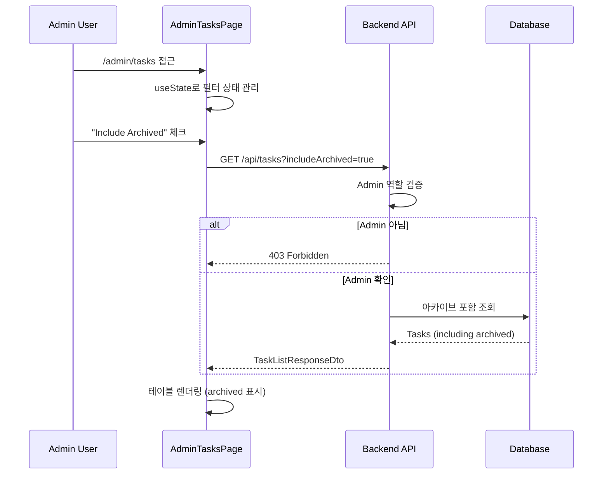

# Admin All Tasks View - Development Plan

## Overview

Story #68: Admin 전용 모든 태스크 조회 페이지 (아카이브 포함)

---

## 구현 상태

| 항목 | 상태 | 설명 |
|------|------|------|
| Task #69: includeArchived 파라미터 (Backend) | ✅ 완료 | Controller에 Admin 검증 추가 |
| Task #70: AdminTasksPage 컴포넌트 (Frontend) | ✅ 완료 | 테이블 뷰 + 필터 |
| Task #71: Admin 전용 네비게이션 (Frontend) | ✅ 완료 | 조건부 렌더링 |

---

## File Structure

```
Backend/
└── Controllers/
    └── TasksController.cs    ← includeArchived 파라미터 + Admin 검증

Frontend/
├── features/task/
│   ├── pages/
│   │   ├── AdminTasksPage.tsx   ← 신규 생성
│   │   ├── BoardPage.tsx        ← Admin 메뉴 추가
│   │   ├── MyTasksPage.tsx      ← Admin 메뉴 추가
│   │   └── AssignedTasksPage.tsx← Admin 메뉴 추가
│   └── types/
│       └── api.types.ts         ← includeArchived 추가
└── router/
    └── AppRouter.tsx            ← /admin/tasks 라우트
```

---

## Data Flow



---

## Security Flow

```
┌─────────────────────────────────────────────────────────────┐
│                    Defense in Depth                          │
├─────────────────────────────────────────────────────────────┤
│                                                              │
│  1️⃣ Frontend - UI 숨김                                      │
│     user?.role === "Admin" && <AdminTabButton />            │
│                                                              │
│  2️⃣ Frontend - 라우트 가드                                  │
│     if (user?.role !== "Admin") return <Navigate />         │
│                                                              │
│  3️⃣ Backend - API 검증                                      │
│     if (includeArchived && role != "Admin") return 403      │
│                                                              │
└─────────────────────────────────────────────────────────────┘
```

---

## Checklist

- [x] Task #69: Controller includeArchived 파라미터 추가
- [x] Task #69: Admin 역할 검증 (403 Forbidden)
- [x] Task #70: TaskQueryParams에 includeArchived 추가
- [x] Task #70: AdminTasksPage 컴포넌트 생성
- [x] Task #70: 테이블 뷰 구현
- [x] Task #70: 필터 (Status, Assignee, Search)
- [x] Task #70: Include Archived 체크박스
- [x] Task #70: 페이지네이션
- [x] Task #70: 아카이브 태스크 시각적 구분 (opacity-50 + badge)
- [x] Task #70: AppRouter에 /admin/tasks 라우트 추가
- [x] Task #70: 비-Admin 접근 시 리다이렉트
- [x] Task #71: BoardPage에 Admin 메뉴 추가
- [x] Task #71: MyTasksPage에 Admin 메뉴 추가
- [x] Task #71: AssignedTasksPage에 Admin 메뉴 추가

---

## Related Documentation

- [01-role-based-access-control.md](./01-role-based-access-control.md) - RBAC 패턴
- [02-design-patterns-and-solid.md](./02-design-patterns-and-solid.md) - 디자인 패턴
- [03-programming-concepts.md](./03-programming-concepts.md) - 프로그래밍 개념
