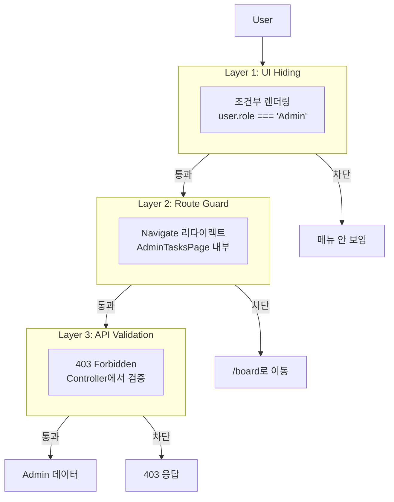
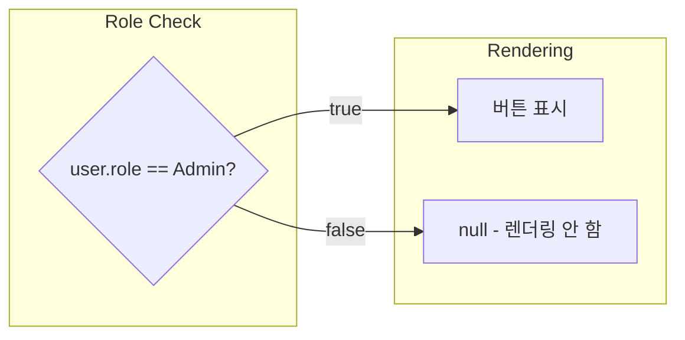
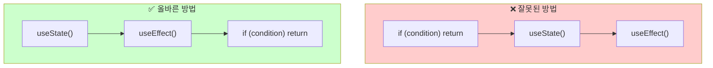
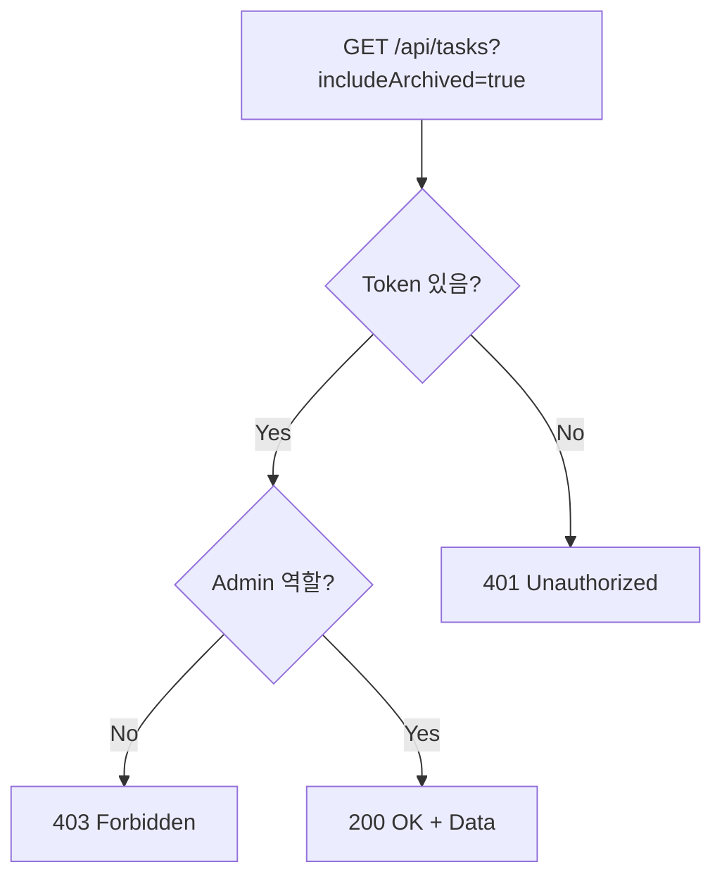

# Role-Based Access Control (RBAC)

## Overview

Admin 전용 기능을 보호하기 위한 다층 보안 패턴

---

## 1. Defense in Depth (심층 방어)



**Why 3 Layers?**
- UI 숨김만으로는 URL 직접 접근 불가
- 프론트엔드 검증만으로는 API 직접 호출 불가
- 백엔드 검증이 최종 보안 관문

---

## 2. Frontend - 조건부 렌더링

### Admin 메뉴 표시 조건

```typescript
// BoardPage.tsx, MyTasksPage.tsx, AssignedTasksPage.tsx
{user?.role === "Admin" && (
  <button onClick={() => navigate("/admin/tasks")}>
    All Tasks (Admin)
  </button>
)}
```



### Optional Chaining (?.)

```typescript
user?.role === "Admin"
```

| user 값 | user?.role | 결과 |
|---------|------------|------|
| `{ role: "Admin" }` | "Admin" | true |
| `{ role: "User" }` | "User" | false |
| `null` | `undefined` | false |
| `undefined` | `undefined` | false |

---

## 3. Frontend - Route Guard

### React Hooks 규칙 준수

```typescript
// AdminTasksPage.tsx
export const AdminTasksPage = () => {
  const navigate = useNavigate();
  const { user } = useAppSelector((state) => state.auth);

  // ✅ 모든 Hooks를 먼저 호출
  const [tasks, setTasks] = useState<TaskResponseDto[]>([]);
  const [loading, setLoading] = useState(true);
  const [filters, setFilters] = useState({ ... });

  // ✅ Hooks 호출 후 조건부 리턴
  if (user?.role !== "Admin") {
    return <Navigate to="/board" replace />;
  }

  // 나머지 컴포넌트 로직...
};
```

### React Hooks 규칙



**Why?**
- React는 Hook 호출 순서로 상태를 추적
- 조건부로 Hook 호출 시 순서가 달라져 에러 발생
- ESLint: "React Hook is called conditionally"

---

## 4. Backend - API 검증

### Controller에서 Admin 검증

```csharp
// TasksController.cs
[HttpGet]
public async Task<IActionResult> GetTasks(
    [FromQuery] bool includeArchived = false)
{
    // Admin만 archived 태스크 요청 가능
    if (includeArchived && GetCurrentUserRole() != "Admin")
    {
        return StatusCode(StatusCodes.Status403Forbidden, new ErrorResponseDto
        {
            Error = "Forbidden",
            Message = "Only administrators can view archived tasks"
        });
    }

    // 정상 처리...
}
```

### HTTP Status Codes

| Code | 의미 | 사용 시점 |
|------|------|----------|
| 401 Unauthorized | 인증 안 됨 | 로그인 필요 |
| 403 Forbidden | 권한 없음 | 로그인했지만 권한 부족 |
| 404 Not Found | 리소스 없음 | 존재하지 않는 데이터 |



---

## 5. 핵심 요약

| Layer | 위치 | 방법 | 목적 |
|-------|------|------|------|
| UI | 메뉴 버튼 | `user?.role === "Admin" &&` | 일반 사용자에게 숨김 |
| Route | Page 컴포넌트 | `<Navigate to="/board" />` | URL 직접 접근 차단 |
| API | Controller | `return 403 Forbidden` | 최종 보안 관문 |

**Remember:** 프론트엔드 보안은 UX 개선이고, 진짜 보안은 백엔드에서!
