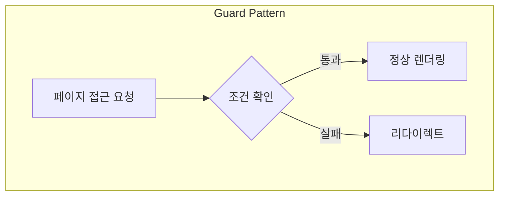
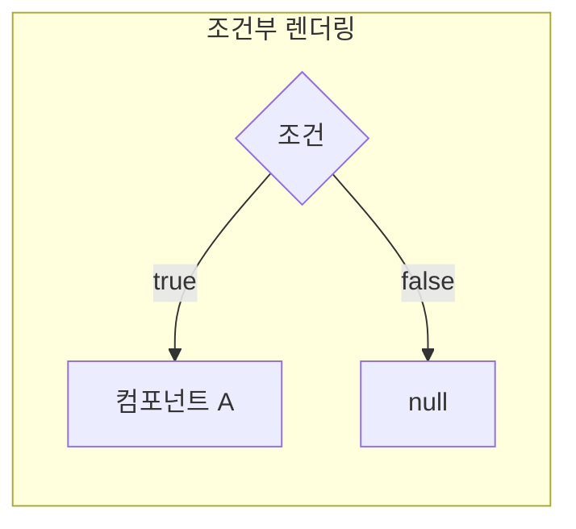
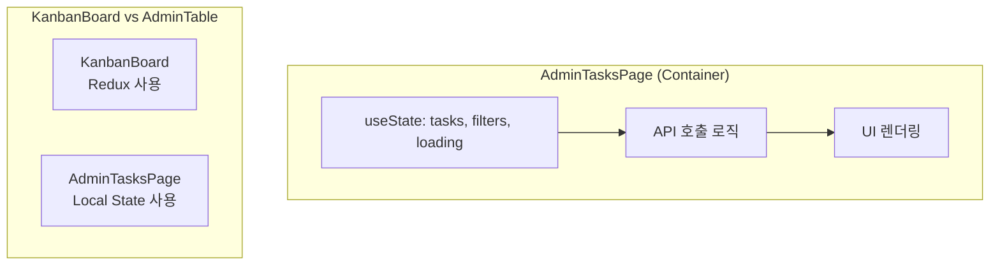
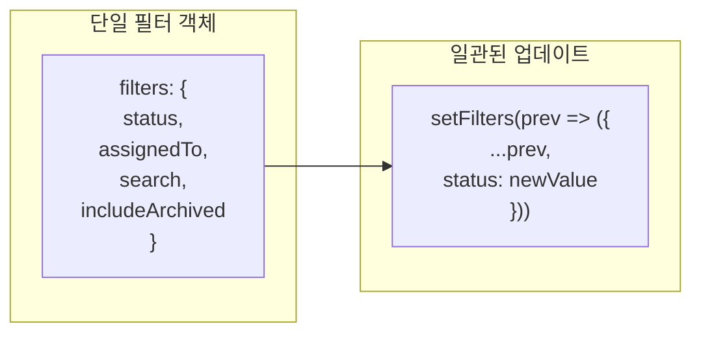
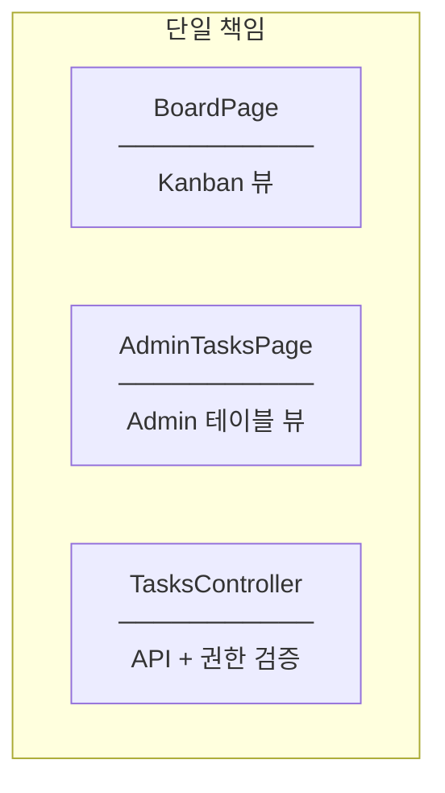
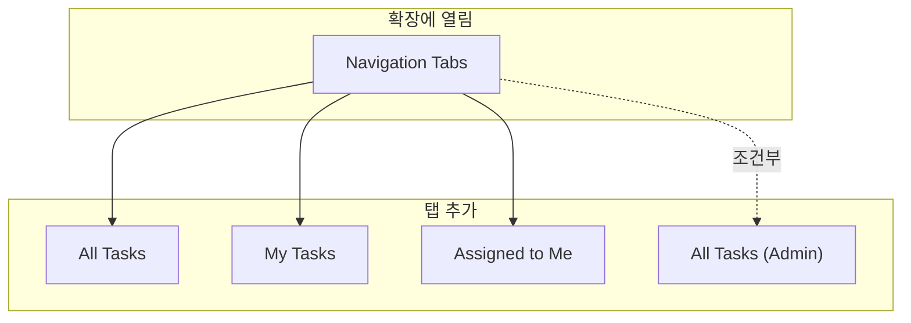
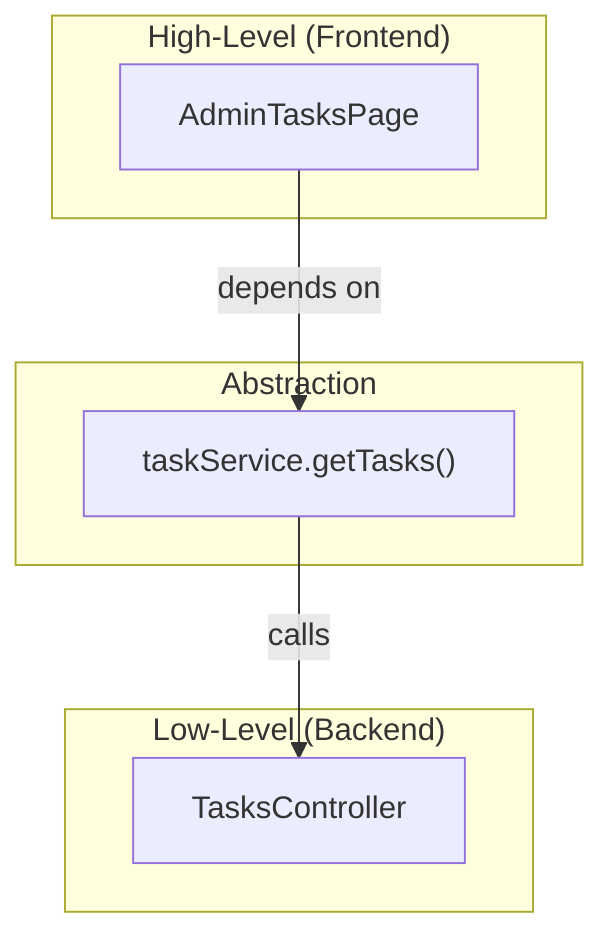

# Design Patterns and SOLID Principles

## Design Patterns

### 1. Guard Pattern (Route Guard)



**구현:**

```typescript
// AdminTasksPage.tsx
if (user?.role !== "Admin") {
  return <Navigate to="/board" replace />;
}
```

**Why Guard Pattern?**
- 권한 없는 사용자의 접근을 조기에 차단
- 불필요한 데이터 로딩 방지
- 사용자에게 명확한 피드백 (리다이렉트)

---

### 2. Conditional Rendering Pattern



**구현:**

```typescript
// Navigation 메뉴에서
{user?.role === "Admin" && (
  <AdminButton />
)}
```

**패턴 비교:**

| 패턴 | 구문 | 사용 시점 |
|------|------|----------|
| `&&` | `condition && <Comp />` | 조건 true일 때만 렌더링 |
| 삼항 | `cond ? <A /> : <B />` | 둘 중 하나 선택 |
| `if` | 일반 if문 | 복잡한 분기 |

---

### 3. Container Pattern (Local State)



**Why Local State?**
- Admin 페이지는 독립적인 필터 상태 필요
- 다른 페이지와 상태 공유 불필요
- 컴포넌트 언마운트 시 상태 자동 초기화

---

### 4. Filter Object Pattern



**구현:**

```typescript
const [filters, setFilters] = useState({
  status: "",
  assignedTo: "",
  search: "",
  includeArchived: false,
});

// 필터 업데이트
const handleFilterChange = (key: string, value: any) => {
  setFilters(prev => ({ ...prev, [key]: value }));
};
```

**Benefits:**
- 관련 상태를 하나의 객체로 그룹화
- 코드 가독성 향상
- 상태 업데이트 일관성

---

## SOLID Principles

### S - Single Responsibility Principle



| 컴포넌트 | 책임 |
|----------|------|
| BoardPage | 일반 사용자 Kanban 뷰 |
| AdminTasksPage | Admin 전용 테이블 뷰 |
| TasksController | API 엔드포인트 + 권한 검증 |

---

### O - Open/Closed Principle



**확장 방법:**
```typescript
// 새 탭 추가 시 기존 코드 수정 최소화
{user?.role === "Admin" && (
  <button>All Tasks (Admin)</button>
)}
```

---

### D - Dependency Inversion Principle



**Frontend는 API 인터페이스에만 의존:**
```typescript
// AdminTasksPage.tsx
const response = await taskService.getTasks({
  ...filters,
  includeArchived: filters.includeArchived,
});
```

---

## 핵심 요약

| 패턴 | 적용 위치 | 목적 |
|------|----------|------|
| Guard Pattern | AdminTasksPage | 권한 없으면 리다이렉트 |
| Conditional Rendering | Navigation | Admin에게만 메뉴 표시 |
| Container Pattern | AdminTasksPage | 로컬 상태로 필터 관리 |
| Filter Object Pattern | filters state | 관련 상태 그룹화 |
