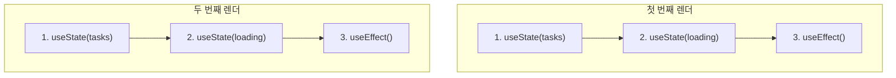
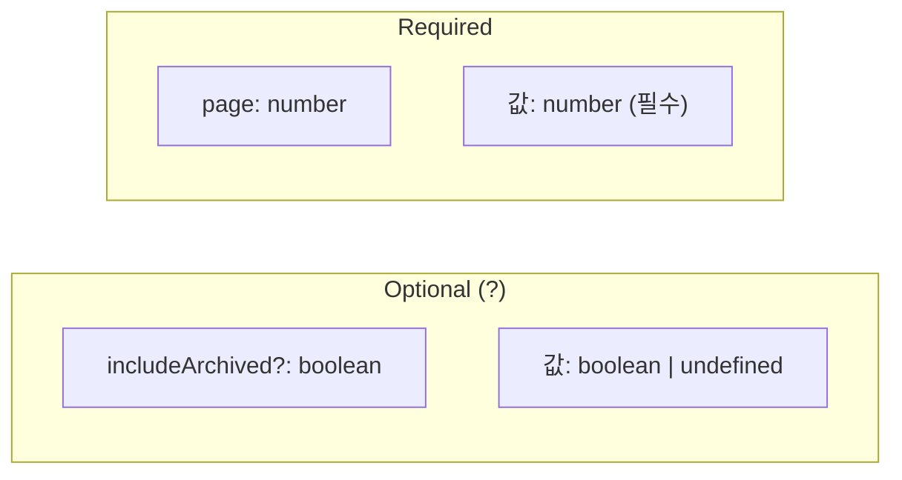
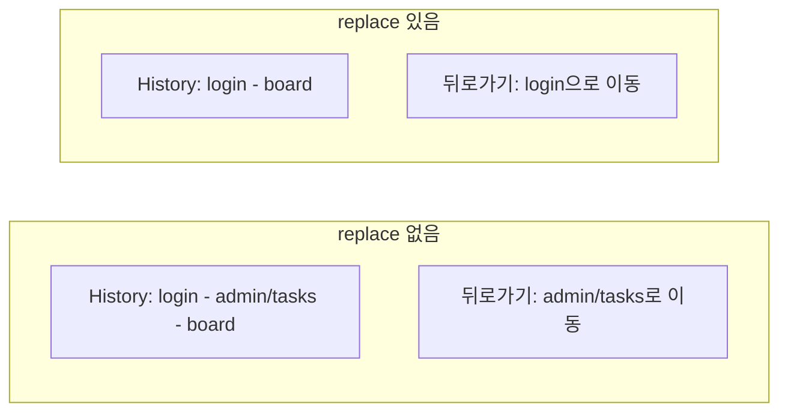
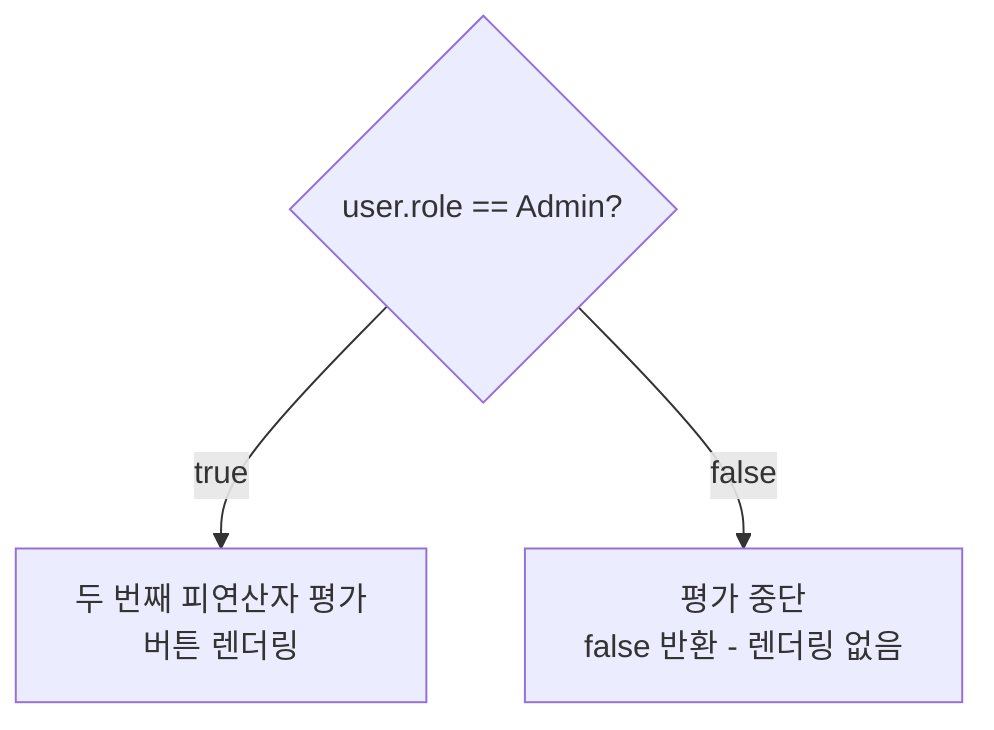

# Programming Concepts

## 1. React Hooks Rules

### 규칙: Hooks는 항상 동일한 순서로 호출



### 잘못된 예시 (조건부 Hook)

```typescript
// ❌ ESLint Error: React Hook is called conditionally
const AdminTasksPage = () => {
  const { user } = useAppSelector((state) => state.auth);

  if (user?.role !== "Admin") {
    return <Navigate to="/board" replace />;
  }

  // Hook이 조건부로 호출됨!
  const [tasks, setTasks] = useState([]);  // ⚠️ Error
};
```

### 올바른 예시

```typescript
// ✅ 모든 Hooks 먼저 호출 후 조건부 리턴
const AdminTasksPage = () => {
  const { user } = useAppSelector((state) => state.auth);
  const [tasks, setTasks] = useState([]);
  const [loading, setLoading] = useState(true);

  // Hooks 호출 완료 후 조건 체크
  if (user?.role !== "Admin") {
    return <Navigate to="/board" replace />;
  }

  return <div>...</div>;
};
```

---

## 2. TypeScript Optional Interface Properties

### TaskQueryParams 확장

```typescript
export interface TaskQueryParams {
  page?: number;
  pageSize?: number;
  status?: TaskStatus;
  assignedTo?: number;
  createdBy?: number;
  search?: string;
  includeArchived?: boolean;  // 새로 추가
}
```

### Optional (?) vs Required



**호출 예시:**

```typescript
// 모두 유효
taskService.getTasks({ page: 1 });                          // includeArchived 생략
taskService.getTasks({ page: 1, includeArchived: true });   // 명시적 true
taskService.getTasks({ page: 1, includeArchived: false });  // 명시적 false
```

---

## 3. React Navigate Component

### Redirect vs Navigate

```typescript
// React Router v5 (구버전)
import { Redirect } from "react-router-dom";
<Redirect to="/board" />

// React Router v6 (현재)
import { Navigate } from "react-router-dom";
<Navigate to="/board" replace />
```

### replace prop



**Why replace?**
- 권한 없는 페이지가 히스토리에 남지 않음
- 뒤로가기 시 리다이렉트 루프 방지

---

## 4. C# Query Parameter Binding

### Controller에서 쿼리 파라미터 수신

```csharp
[HttpGet]
public async Task<IActionResult> GetTasks(
    [FromQuery] int page = 1,
    [FromQuery] int pageSize = 20,
    [FromQuery] bool includeArchived = false)  // 기본값 false
{
    // URL: /api/tasks?includeArchived=true
    // includeArchived = true
}
```

### [FromQuery] Attribute

| Source | Attribute | 예시 URL |
|--------|-----------|----------|
| Query String | `[FromQuery]` | `/api/tasks?page=1` |
| Route | `[FromRoute]` | `/api/tasks/123` |
| Body | `[FromBody]` | POST body JSON |

---

## 5. Short-Circuit Evaluation

### && 연산자로 조건부 렌더링

```typescript
{user?.role === "Admin" && (
  <button>Admin Button</button>
)}
```

**동작 원리:**



**Truth Table:**

| Left | Right | Result |
|------|-------|--------|
| `true` | `<Button />` | `<Button />` |
| `false` | `<Button />` | `false` (not rendered) |

---

## 6. Computed Property Names

### 동적 필터 업데이트

```typescript
const handleFilterChange = (key: string, value: any) => {
  setFilters(prev => ({
    ...prev,
    [key]: value  // Computed Property Name
  }));
};

// 사용
handleFilterChange("status", "Done");
// 결과: { ...prev, status: "Done" }
```

**Syntax:**

```typescript
const key = "dynamicKey";

// ES5 방식
const obj = {};
obj[key] = "value";

// ES6+ Computed Property
const obj = { [key]: "value" };
```

---

## 7. 핵심 요약

| 개념 | 설명 | 예시 |
|------|------|------|
| Hooks Rules | 항상 동일한 순서로 호출 | 조건부 return은 Hooks 이후 |
| Optional Props | `?`로 선택적 속성 정의 | `includeArchived?: boolean` |
| Navigate | 선언적 리다이렉트 | `<Navigate to="/board" replace />` |
| [FromQuery] | 쿼리 파라미터 바인딩 | `?includeArchived=true` |
| Short-Circuit | `&&`로 조건부 렌더링 | `condition && <Comp />` |
| Computed Props | 동적 속성명 | `{ [key]: value }` |
