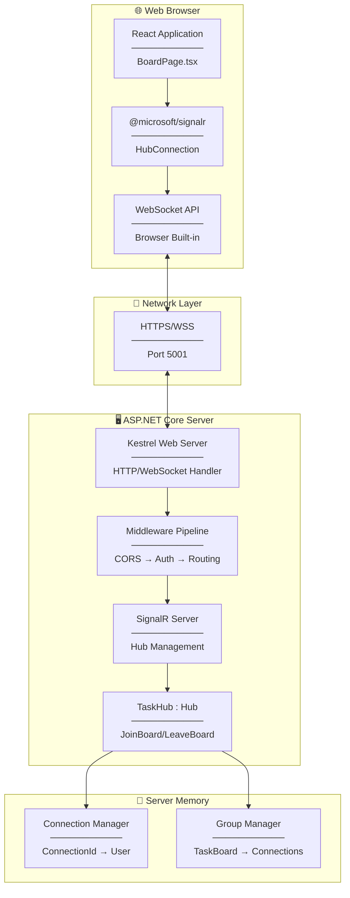
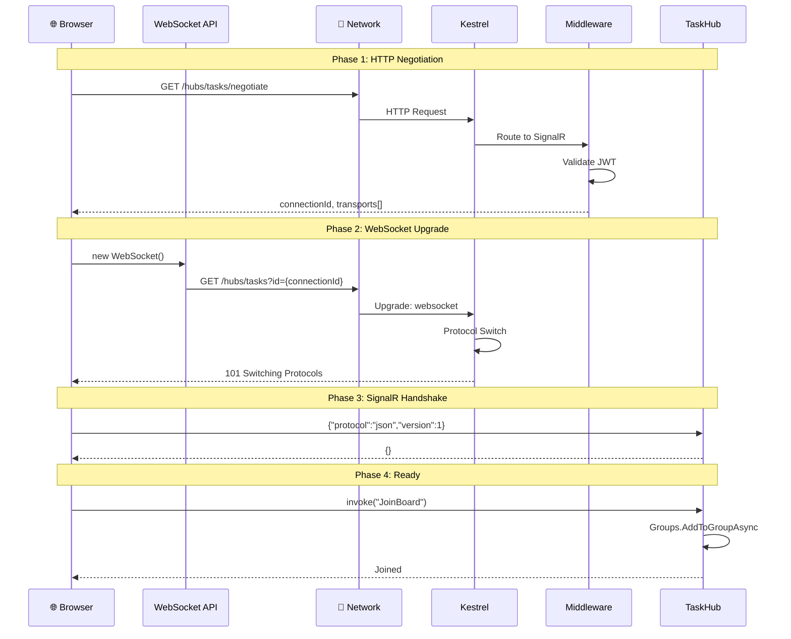
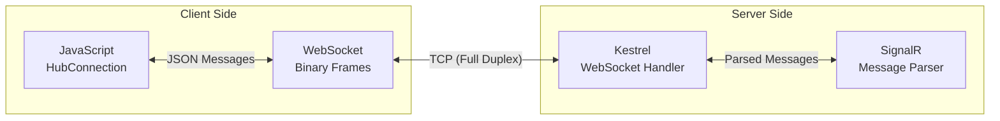
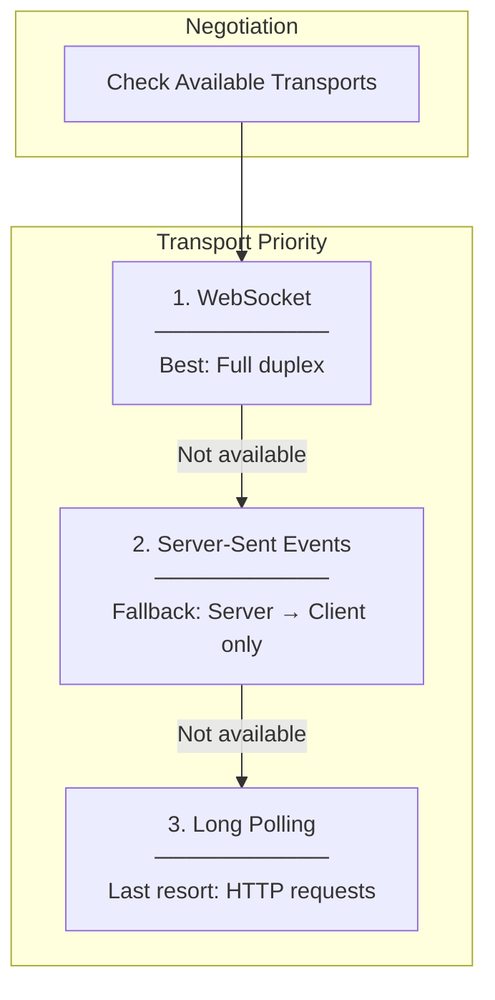
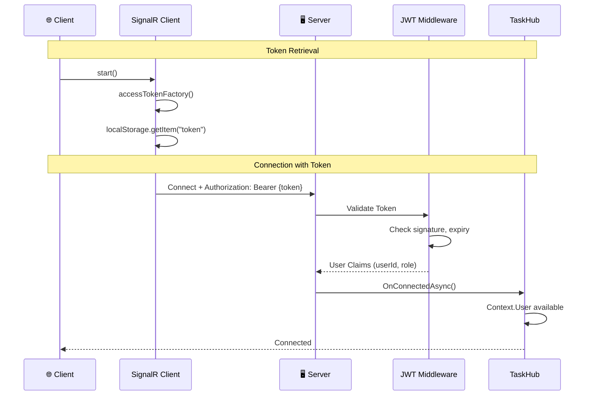
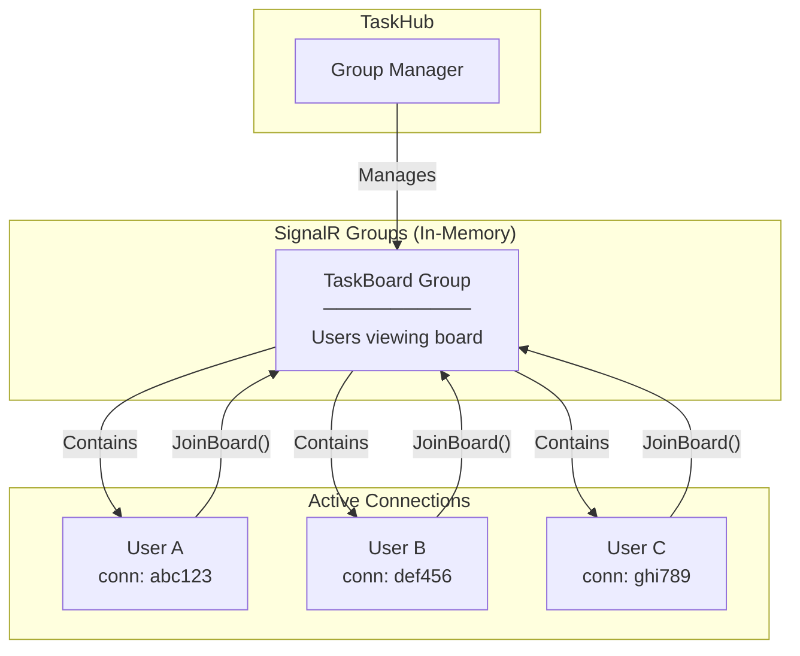
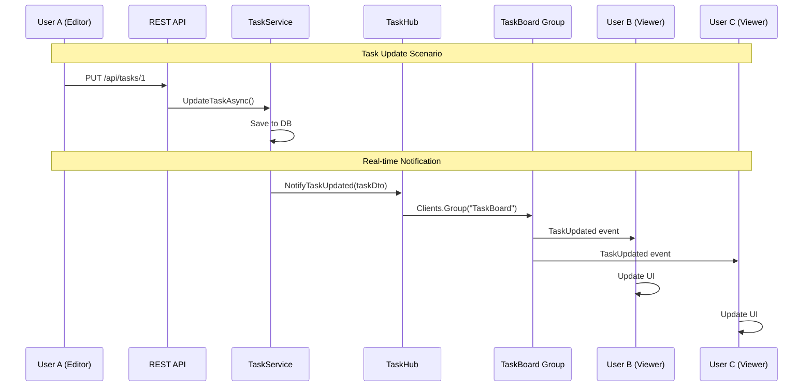

# SignalR Infrastructure Overview

## Introduction

이 문서는 SignalR 실시간 통신 인프라의 전체 구조를 설명합니다.
Backend, Frontend, Browser, Network 레이어를 모두 포함합니다.

**관련 구현:**
- Task #51: Backend TaskHub
- Task #52: Frontend SignalR Client
- Task #54-56: Real-time notifications (✅ 완료)

**아키텍처 발전 문서:** [03-architecture-evolution-story53.md](./03-architecture-evolution-story53.md)

---

## Full Stack Architecture



---

## Connection Establishment Flow



---

## Transport Layer Details

### WebSocket (Primary Transport)



**WebSocket Characteristics:**
| Feature | Description |
|---------|-------------|
| Protocol | `wss://` (WebSocket Secure) |
| Connection | Persistent, bi-directional |
| Port | Same as HTTPS (5001) |
| Latency | Very low (no HTTP overhead) |
| Firewall | Usually allowed (uses port 443/5001) |

---

### Transport Fallback



**When fallbacks are used:**
- WebSocket blocked by proxy/firewall
- Old browser without WebSocket support
- Network issues with persistent connections

---

## Authentication Flow



**Code Reference:**
```typescript
// Frontend: accessTokenFactory
.withUrl(HUB_URL, {
  accessTokenFactory: () => localStorage.getItem("token") || "",
})

// Backend: [Authorize] attribute
[Authorize]
public class TaskHub : Hub
```

---

## Group Management



**Group Lifecycle:**
1. User navigates to BoardPage
2. `JoinBoard()` called → Added to "TaskBoard" group
3. User leaves BoardPage
4. `LeaveBoard()` called → Removed from group
5. If user disconnects without leaving → Auto-removed

---

## Message Flow (Future Implementation)



**향후 구현 예정:**
- NotificationService (Application Layer)
- TaskUpdated, TaskCreated, TaskDeleted 이벤트
- Client-side event handlers

---

## Current Implementation Status

### ✅ Implemented (Story #50)

| Component | Location | Status |
|-----------|----------|--------|
| TaskHub | `Backend/Hubs/TaskHub.cs` | ✅ |
| SignalR Service Registration | `Backend/Program.cs` | ✅ |
| Hub Endpoint Mapping | `Backend/Program.cs` | ✅ |
| signalRService | `Frontend/services/signalRService.ts` | ✅ |
| BoardPage Connection | `Frontend/pages/BoardPage.tsx` | ✅ → App.tsx로 이동 |
| CORS Configuration | `Backend/Program.cs` | ✅ |

### ✅ Implemented (Story #53)

| Component | Location | Status |
|-----------|----------|--------|
| INotificationService | `Backend/Services/Interfaces/` | ✅ Task #54 |
| NotificationService | `Backend/Services/` | ✅ Task #54 |
| TaskService 연동 | `Backend/Services/TaskService.cs` | ✅ Task #55 |
| Event Handlers | `Frontend/services/signalRService.ts` | ✅ Task #56 |
| SignalR Reducers | `Frontend/features/task/store/taskSlice.ts` | ✅ Task #56 |
| App-Level Connection | `Frontend/App.tsx` | ✅ Task #56 |
| JWT SignalR Auth | `Backend/Program.cs` | ✅ Bug Fix |

### 🔜 Planned (Future Tasks)

| Component | Description | Task # |
|-----------|-------------|--------|
| Personal Notifications | Send to specific user | TBD |
| Notification UI | Toast/Badge display | TBD |
| Notification History | DB storage and retrieval | TBD |
| Redis Backplane | Multi-server support | TBD |

---

## Configuration Reference

### Backend (Program.cs)

```csharp
// 1. Service Registration
builder.Services.AddSignalR();

// 2. CORS (Required for SignalR)
policy.AllowCredentials();  // Important!
policy.WithOrigins("http://localhost:5173");

// 3. Endpoint Mapping
app.MapHub<TaskHub>("/hubs/tasks");
```

### Frontend (signalRService.ts)

```typescript
// Hub URL
const HUB_URL = "https://localhost:5001/hubs/tasks";

// Connection Builder
new HubConnectionBuilder()
  .withUrl(HUB_URL, {
    accessTokenFactory: () => localStorage.getItem("token") || "",
  })
  .withAutomaticReconnect()
  .build();
```

---

## Network Requirements

| Requirement | Value | Notes |
|-------------|-------|-------|
| Protocol | HTTPS/WSS | Secure WebSocket |
| Port | 5001 | Backend server port |
| CORS | Enabled | Frontend origin allowed |
| Credentials | Required | JWT token in header |
| Firewall | Allow WSS | WebSocket upgrade allowed |

---

## Troubleshooting Guide

### Connection Issues

| Symptom | Possible Cause | Solution |
|---------|----------------|----------|
| 401 Unauthorized | Invalid/expired token | Check token in localStorage |
| CORS error | Origin not allowed | Add origin to CORS policy |
| Connection refused | Server not running | Start backend server |
| WebSocket failed | Proxy blocking | Check proxy/firewall settings |

### Debug Commands

**Browser Console:**
```javascript
// Check connection state
signalRService.getConnection().state

// Manual connect
await signalRService.start()

// Check token
localStorage.getItem("token")
```

**Backend Logs:**
```
SignalR connection established: {connectionId}
User joined TaskBoard group: {userId}
```

---

## Related Documentation

| Document | Path | Description |
|----------|------|-------------|
| Backend Hub | `learning-notes/backend/51-signalr-hub/` | TaskHub implementation |
| Frontend Client | `learning-notes/frontend/52-signalr-client/` | SignalR service |
| Architecture Evolution | `03-architecture-evolution-story53.md` | Story #53 아키텍처 변화 |
| App vs Page Level | `01-app-level-vs-page-level.md` | 연결 관리 위치 비교 |
| camelCase 직렬화 | `02-camelcase-serialization.md` | JSON 데이터 형식 변환 |
| Frontend Task #56 | `learning-notes/frontend/56-signalr-event-handling/` | SignalR 이벤트 핸들링 |

---

## Changelog

| Date | Task | Changes |
|------|------|---------|
| 2024-XX-XX | #51 | TaskHub created, Program.cs configured |
| 2024-XX-XX | #52 | signalRService.ts, BoardPage integration |
| 2024-12-13 | #54 | INotificationService, NotificationService 추가 |
| 2024-12-13 | #55 | TaskService에서 NotificationService 호출 |
| 2024-12-13 | #56 | Frontend Event Handlers, Redux 통합, App-Level 연결 |
| 2024-12-13 | Bug Fix | JWT SignalR 인증 (Query String), camelCase 수정 |
