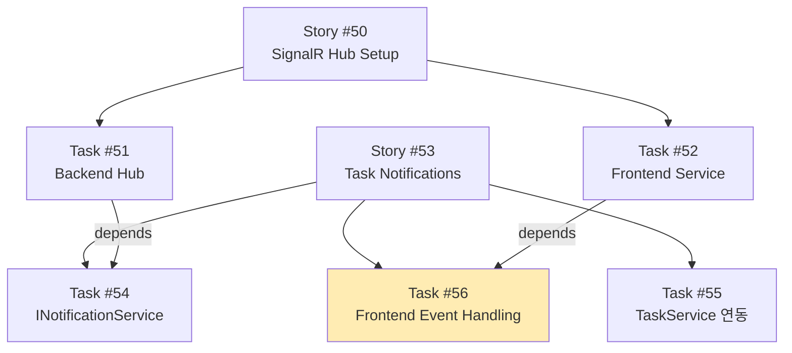

# SignalR Infrastructure - 실시간 통신 아키텍처 심화 학습

## 개요
이 폴더는 SignalR 기반 실시간 통신 구현 과정에서 발생한 아키텍처적 이슈와 해결 방안을 다룹니다.

## 문서 목록

| 파일 | 주제 | 핵심 내용 |
|------|------|----------|
| [01-app-level-vs-page-level.md](./01-app-level-vs-page-level.md) | 연결 관리 위치 | App vs Page 레벨 SignalR 연결의 장단점 |
| [02-camelcase-serialization.md](./02-camelcase-serialization.md) | JSON 직렬화 | Backend-Network-Frontend 간 데이터 형식 변환 |

## 배경

### 구현 과정에서 발생한 이슈들

1. **실시간 업데이트 누락**
   - 증상: Create Task 페이지로 이동하면 실시간 업데이트가 안 됨
   - 원인: Page-Level 연결로 인한 disconnect
   - 해결: App-Level 연결로 변경

2. **데이터 undefined 오류**
   - 증상: SignalR 이벤트 수신되나 `data.Task`가 undefined
   - 원인: C# → JSON camelCase 변환
   - 해결: `data.task` (소문자)로 접근

## 관련 Task 및 Story

## 기술 스택

- **Backend**: ASP.NET Core SignalR, IHubContext
- **Frontend**: @microsoft/signalr, React, Redux Toolkit
- **Protocol**: WebSocket (HTTP Upgrade)
- **Authentication**: JWT (Query String for WebSocket)
