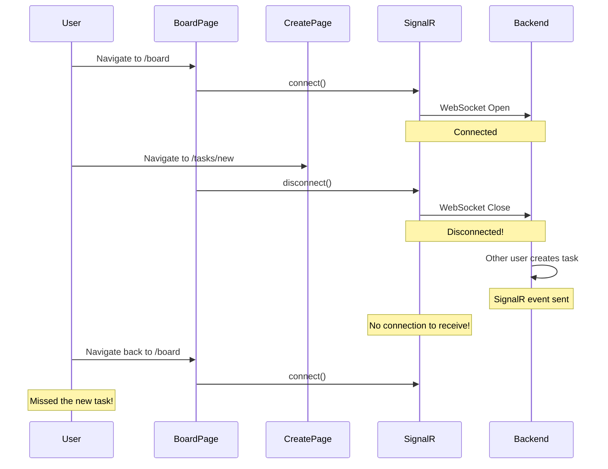
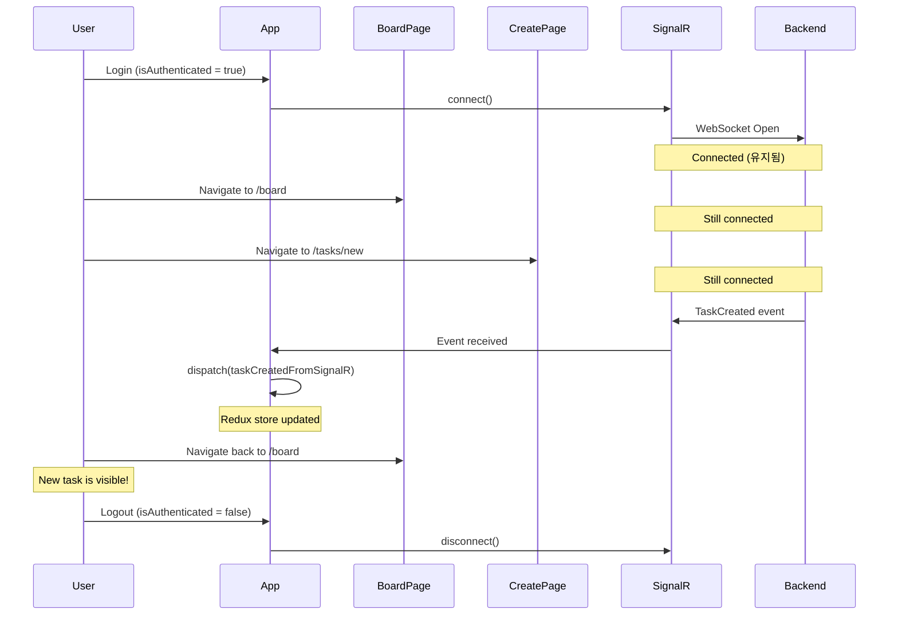
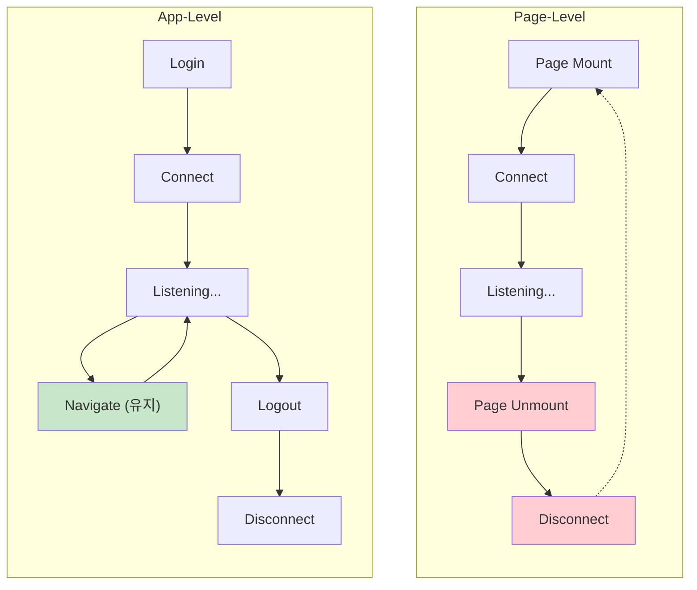
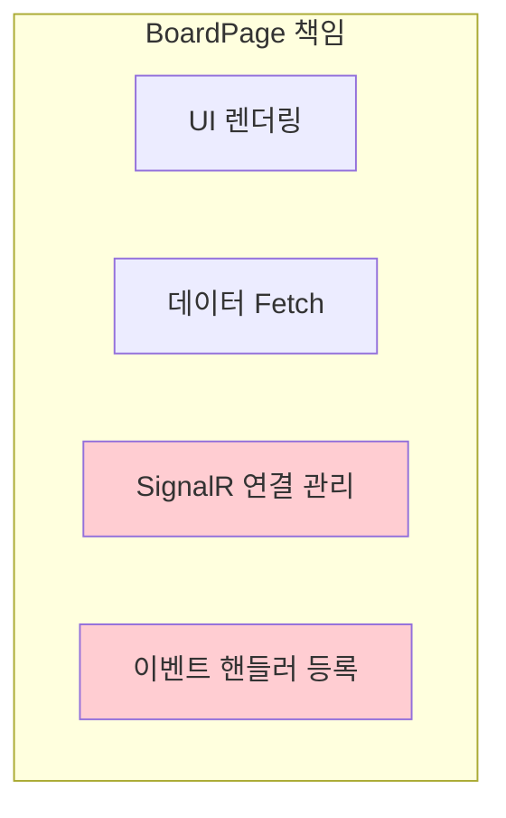
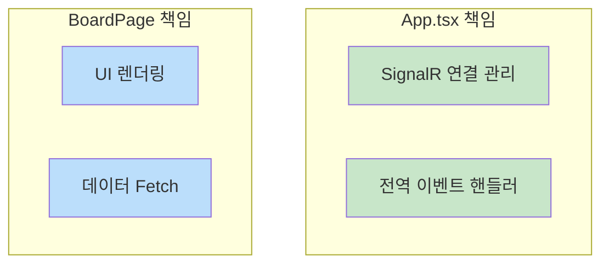
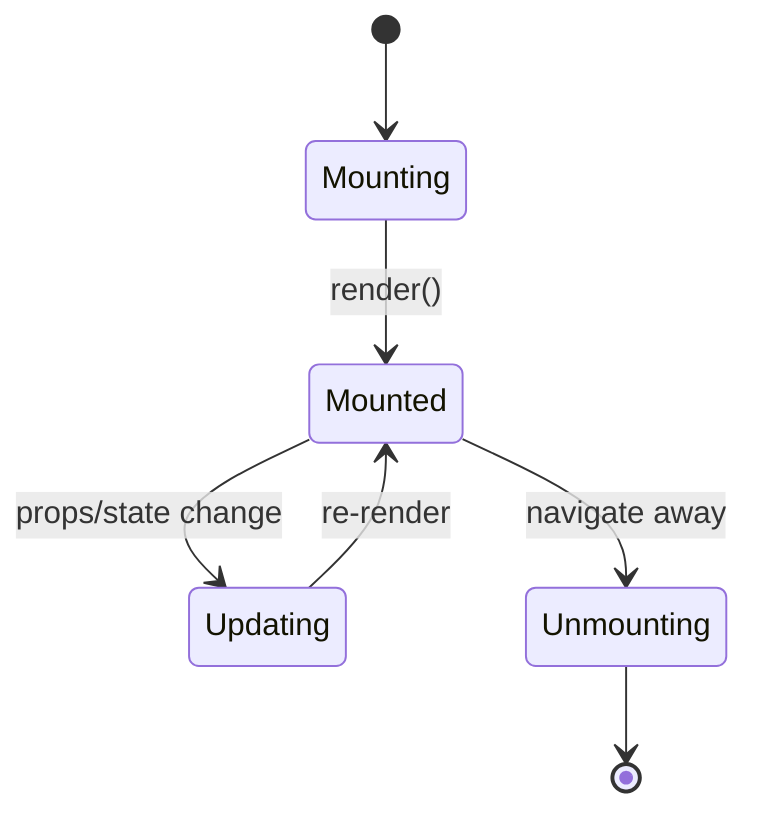

# App-Level vs Page-Level SignalR Connection

## 문제 상황

### 증상
- BoardPage에서 SignalR 연결됨
- Create Task 페이지로 이동
- 다른 사용자가 Task 생성
- BoardPage로 돌아와도 새 Task가 안 보임

### Console 로그
```
SignalR connected
Joined TaskBoard group
// Navigate to /tasks/new
SignalR disconnected      // ← 문제!
Left TaskBoard group
// Navigate back to /board
SignalR connected         // 다시 연결되지만 이미 놓친 이벤트
Joined TaskBoard group
```

---

## 아키텍처 비교

### Page-Level Connection (이전 방식)



### App-Level Connection (현재 방식)



---

## 코드 비교

### Page-Level (BoardPage.tsx) - 이전 방식

```typescript
// BoardPage.tsx
export const BoardPage = () => {
  useEffect(() => {
    // Page mount → connect
    signalRService.start();
    signalRService.joinBoard();

    signalRService.onTaskCreated((data) => {
      dispatch(taskCreatedFromSignalR(data.task));
    });

    // Page unmount → disconnect
    return () => {
      signalRService.offTaskCreated();
      signalRService.leaveBoard();
      signalRService.stop();
    };
  }, []);
};
```

**문제점:**
- 페이지 이동 시 unmount → disconnect
- 다른 페이지에서 실시간 업데이트 못 받음

### App-Level (App.tsx) - 현재 방식

```typescript
// App.tsx
function App() {
  const { isAuthenticated } = useAppSelector((state) => state.auth);

  useEffect(() => {
    if (!isAuthenticated) return;

    // Login → connect
    signalRService.start();
    signalRService.joinBoard();

    signalRService.onTaskCreated((data) => {
      dispatch(taskCreatedFromSignalR(data.task));
    });

    // Logout → disconnect
    return () => {
      signalRService.offTaskCreated();
      signalRService.leaveBoard();
      signalRService.stop();
    };
  }, [isAuthenticated]);
}
```

**장점:**
- 페이지 이동과 무관하게 연결 유지
- 어느 페이지에서든 실시간 업데이트 수신

---

## 연결 Lifecycle 비교



---

## 컴포넌트 책임 분리

### Page-Level (잘못된 책임 분배)



**문제:** BoardPage가 너무 많은 책임을 가짐

### App-Level (적절한 책임 분배)



**장점:** Single Responsibility Principle 준수

---

## 언제 어떤 방식을 사용해야 하는가?

### App-Level 사용 (권장)
- 실시간 업데이트가 앱 전체에서 필요할 때
- 여러 페이지에서 같은 데이터를 공유할 때
- 채팅, 알림, 협업 도구 등

### Page-Level 사용 (특수 케이스)
- 특정 페이지에서만 사용하는 실시간 기능
- 리소스 최적화가 중요할 때 (연결 유지 비용)
- 예: 실시간 주식 차트 (해당 페이지에서만)

---

## 관련 개념

### React Component Lifecycle



### SPA (Single Page Application)
- 페이지 전환 시 전체 새로고침 없음
- React Router가 컴포넌트 mount/unmount 관리
- App 컴포넌트는 항상 마운트 상태

---

## 결론

| 항목 | Page-Level | App-Level |
|------|------------|-----------|
| 연결 지속성 | 페이지별 | 로그인 동안 유지 |
| 실시간 업데이트 | 해당 페이지만 | 전체 앱 |
| 리소스 사용 | 페이지별 연결/해제 | 단일 연결 유지 |
| 적합한 경우 | 특정 페이지 전용 | 전역 실시간 기능 |
| 코드 복잡도 | 페이지마다 중복 | 중앙 집중 관리 |
