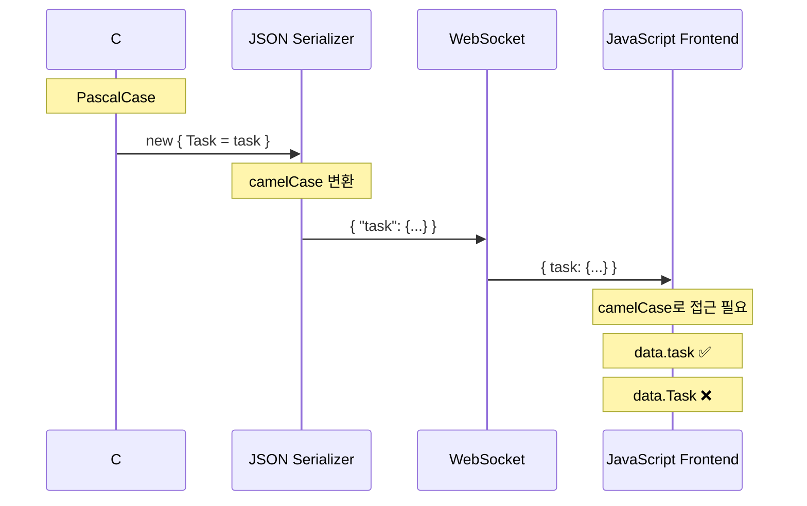
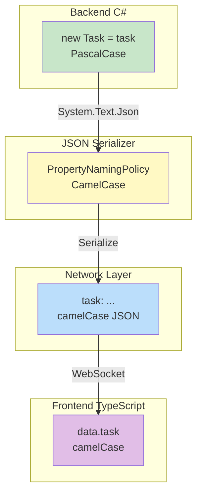
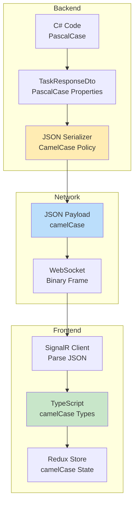

# camelCase vs PascalCase - JSON 직렬화와 데이터 형식 변환

## 문제 상황

### 증상
```
[SignalR] TaskCreated received: { task: {...}, createdBy: "John" }
```
- Console에 데이터가 찍힘 → SignalR 이벤트 정상 수신
- 하지만 Redux store에 추가 안 됨

### 원인
```typescript
// 코드
dispatch(taskCreatedFromSignalR(data.Task));  // undefined!

// 실제 데이터
{ task: {...}, createdBy: "John" }  // 소문자 task
```

---

## 전체 데이터 흐름



---

## 계층별 데이터 형식

### Backend (C#) - PascalCase

```csharp
// NotificationService.cs
await _hubContext.Clients.Group(BoardGroup)
    .SendAsync("TaskCreated", new { Task = task, CreatedBy = createdByName });
//                                  ^^^^^       ^^^^^^^^^
//                                  PascalCase  PascalCase
```

### JSON Serializer 설정 (Program.cs)

```csharp
// ASP.NET Core 기본 설정
builder.Services.AddControllers()
    .AddJsonOptions(options =>
    {
        // 기본값: camelCase
        options.JsonSerializerOptions.PropertyNamingPolicy = JsonNamingPolicy.CamelCase;
    });

// SignalR도 같은 설정 적용
builder.Services.AddSignalR()
    .AddJsonProtocol(options =>
    {
        options.PayloadSerializerOptions.PropertyNamingPolicy = JsonNamingPolicy.CamelCase;
    });
```

### Network (WebSocket) - camelCase JSON

```json
{
  "task": {
    "id": 1,
    "title": "Test Task",
    "status": "ToDo"
  },
  "createdBy": "John Doe"
}
```

### Frontend (TypeScript) - camelCase 접근

```typescript
// signalRService.ts - 타입 정의
const onTaskCreated = (
  callback: (data: { task: TaskResponseDto; createdBy: string }) => void
//                   ^^^^                   ^^^^^^^^^
//                   camelCase              camelCase
): void => {
  getConnection().on("TaskCreated", callback);
};

// App.tsx - 데이터 접근
signalRService.onTaskCreated((data) => {
  dispatch(taskCreatedFromSignalR(data.task));  // 소문자!
});
```

---

## 변환 과정 상세



---

## 왜 camelCase가 기본인가?

### JavaScript/JSON 컨벤션
- JSON은 JavaScript Object Notation
- JavaScript는 camelCase가 표준
- 대부분의 API는 camelCase로 응답

### 언어별 Naming Convention

| 언어 | Convention | 예시 |
|------|------------|------|
| C# | PascalCase | `TaskId`, `CreatedBy` |
| Java | camelCase | `taskId`, `createdBy` |
| JavaScript/TypeScript | camelCase | `taskId`, `createdBy` |
| Python | snake_case | `task_id`, `created_by` |

### ASP.NET Core의 선택
- API 응답을 JavaScript에서 쉽게 사용하도록
- JSON 표준 컨벤션 준수
- 프론트엔드 친화적

---

## 해결 방법들

### 방법 1: Frontend에서 camelCase 사용 (권장)

```typescript
// ✅ 올바른 방법
signalRService.onTaskCreated((data) => {
  dispatch(taskCreatedFromSignalR(data.task));  // camelCase
});
```

**장점:**
- JSON 표준 준수
- 별도 설정 변경 불필요
- 대부분의 프로젝트에서 사용하는 방식

### 방법 2: Backend에서 PascalCase 유지 (비권장)

```csharp
// 전역 설정 변경
builder.Services.AddControllers()
    .AddJsonOptions(options =>
    {
        options.JsonSerializerOptions.PropertyNamingPolicy = null;  // PascalCase 유지
    });
```

**단점:**
- JSON 표준 위반
- 다른 API와 일관성 깨짐
- 프론트엔드 개발자 혼란

### 방법 3: JsonPropertyName 명시 (특수 케이스)

```csharp
public class TaskNotification
{
    [JsonPropertyName("Task")]  // 강제로 PascalCase
    public TaskResponseDto Task { get; set; }
}
```

**단점:**
- 모든 DTO에 어트리뷰트 추가 필요
- 유지보수 어려움

---

## 디버깅 팁

### Console에서 데이터 구조 확인

```typescript
signalRService.onTaskCreated((data) => {
  console.log("[SignalR] TaskCreated received:", data);
  console.log("Keys:", Object.keys(data));
  //                                    ↑ ["task", "createdBy"] (camelCase)
});
```

### TypeScript 컴파일러 활용

```typescript
// 타입 정의가 올바르면 컴파일 에러로 발견
callback: (data: { Task: TaskResponseDto }) => void  // PascalCase 타입

data.task  // ❌ Property 'task' does not exist
data.Task  // ✅ 타입은 맞지만 런타임에 undefined
```

**교훈:** TypeScript 타입이 맞아도 런타임 데이터와 다를 수 있음!

---

## 전체 시스템 관점



---

## 체크리스트

SignalR 이벤트 구현 시:

- [ ] Backend 코드에서 anonymous object 속성명 확인
- [ ] Frontend 타입 정의를 camelCase로 작성
- [ ] Frontend 코드에서 camelCase로 데이터 접근
- [ ] Console.log로 실제 데이터 구조 확인
- [ ] TypeScript 타입과 런타임 데이터 일치 확인

---

## 결론

| 계층 | Naming | 이유 |
|------|--------|------|
| C# 코드 | PascalCase | C# 컨벤션 |
| JSON | camelCase | JSON/JS 표준 |
| TypeScript 타입 | camelCase | JSON과 일치 |
| 런타임 데이터 | camelCase | JSON 파싱 결과 |

**핵심:** Backend는 PascalCase로 작성하되, Frontend는 항상 camelCase로 받는다고 생각하면 됨.
