# SignalR Architecture Evolution - Story #53

## 개요

이 문서는 Story #50 (기본 설정)에서 Story #53 (실시간 알림)으로 발전하면서 SignalR 아키텍처가 어떻게 변화했는지 설명합니다.

---

## 아키텍처 발전 요약

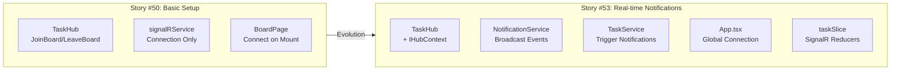

---

## Before vs After 비교

### 1. 전체 시스템 아키텍처

#### Before (Story #50)

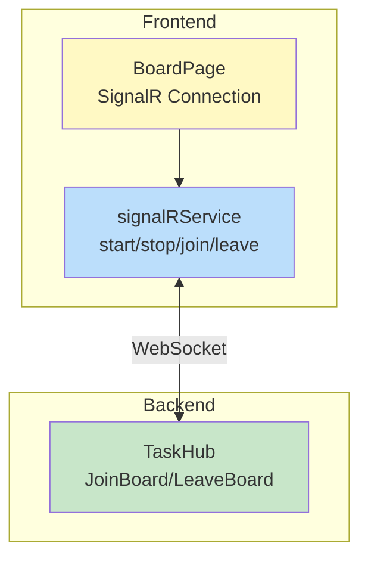

**특징:**
- Hub는 연결 관리만 담당
- 클라이언트 → 서버 방향만 가능
- 실제 데이터 브로드캐스트 없음

#### After (Story #53)

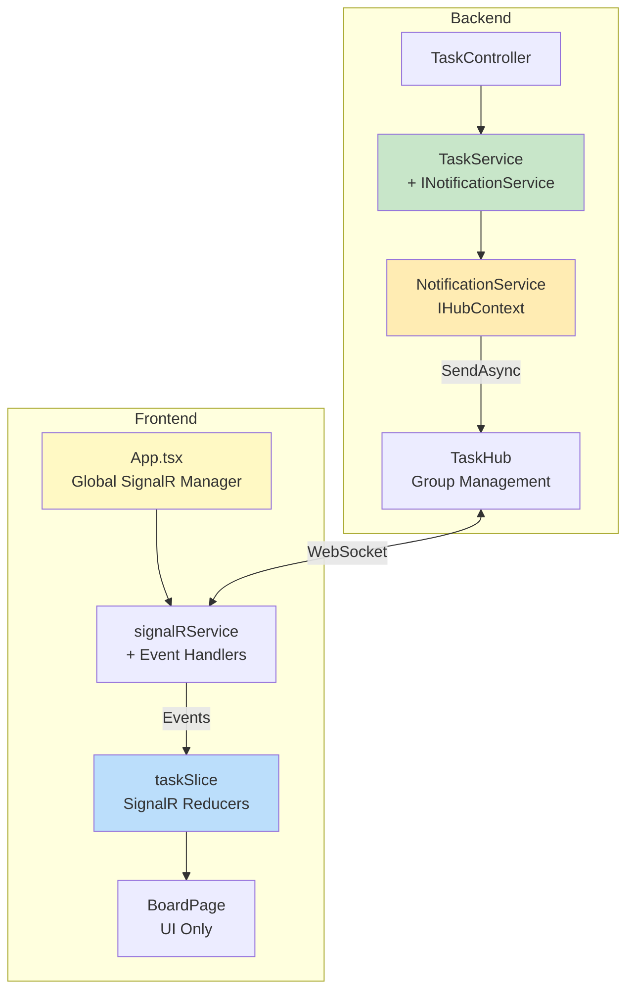

**변화:**
- Server → Client 브로드캐스트 추가
- NotificationService로 Hub 외부에서 메시지 전송
- App-Level 연결 관리로 안정성 향상
- Redux 통합으로 상태 자동 업데이트

---

### 2. 연결 관리 위치 변화

#### Before: Page-Level

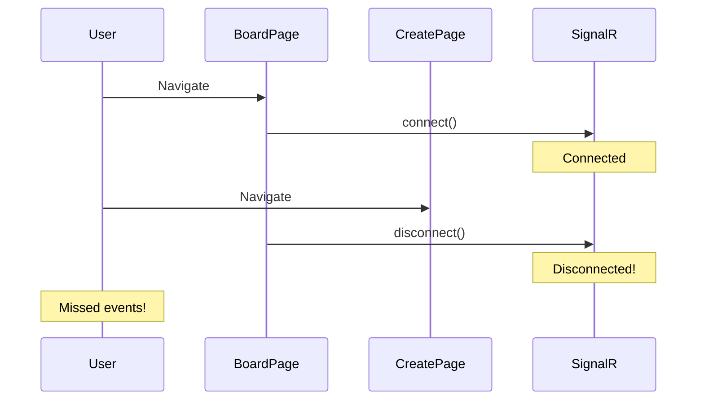

#### After: App-Level

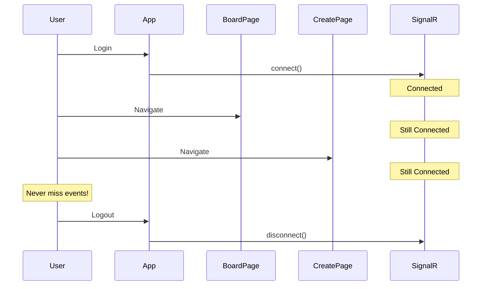

---

### 3. 메시지 흐름 변화

#### Before: 연결만 가능

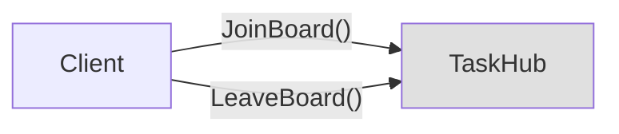

**한계:** Hub에서 클라이언트로 메시지 전송 불가

#### After: 양방향 통신

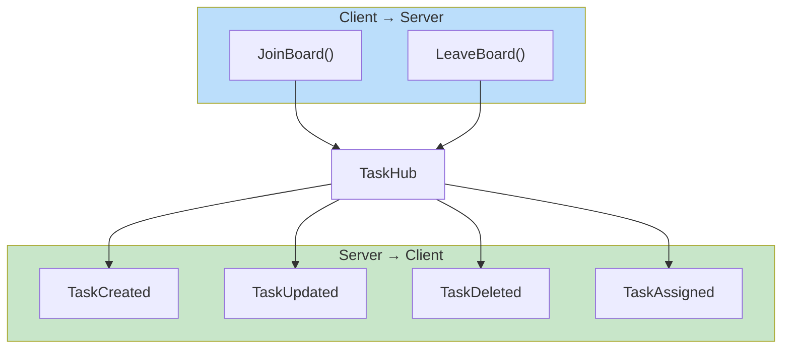

---

### 4. 백엔드 레이어 변화

#### Before: Hub만 존재

```
Controllers/
  TaskController.cs     ← CRUD만
Hubs/
  TaskHub.cs            ← 연결 관리만
```

#### After: Notification Layer 추가

```
Controllers/
  TaskController.cs
Services/
  TaskService.cs        ← INotificationService 주입
  Interfaces/
    INotificationService.cs   ← 새로 추가
  NotificationService.cs      ← 새로 추가 (IHubContext 사용)
Hubs/
  TaskHub.cs            ← 변경 없음
```

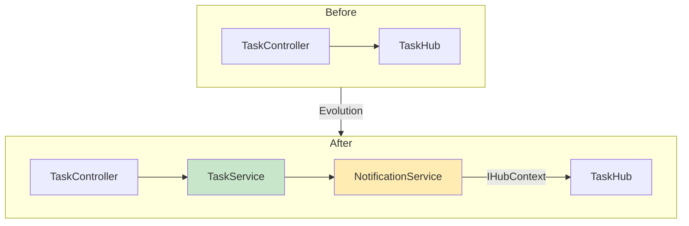

---

### 5. 프론트엔드 상태 관리 변화

#### Before: 수동 Refresh 필요

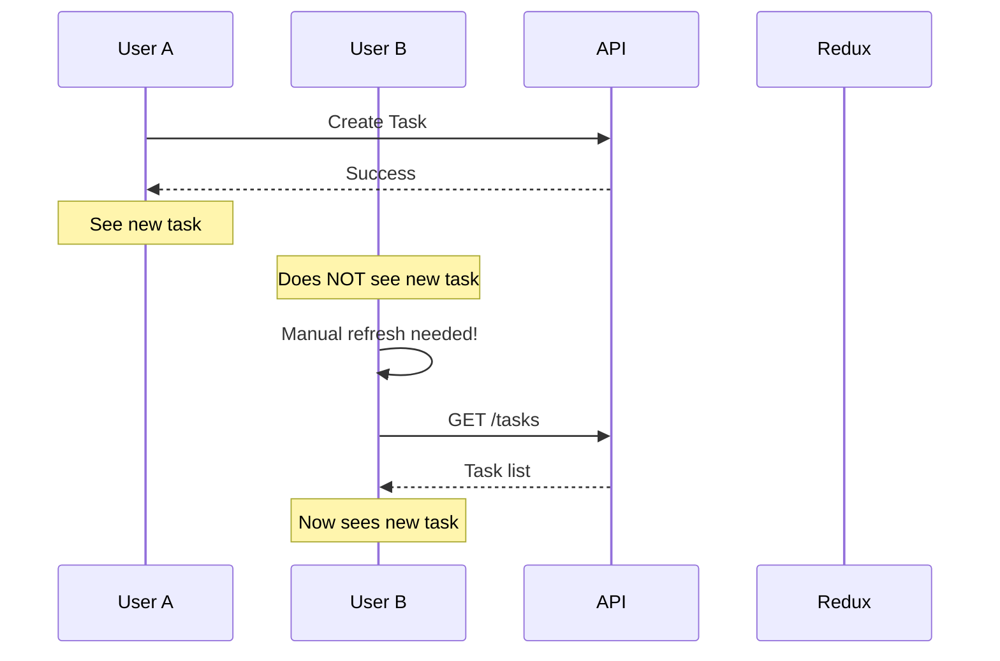

#### After: 자동 실시간 업데이트

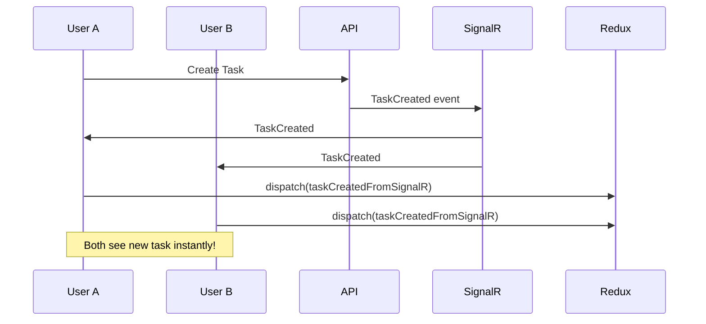

---

## 새로 추가된 컴포넌트

### Backend

| 컴포넌트 | 파일 | 역할 |
|----------|------|------|
| INotificationService | `Services/Interfaces/` | 알림 서비스 인터페이스 |
| NotificationService | `Services/` | IHubContext로 브로드캐스트 |
| TaskService 수정 | `Services/` | CRUD 시 알림 호출 |
| Program.cs 수정 | - | DI 등록, JWT SignalR 설정 |

### Frontend

| 컴포넌트 | 파일 | 역할 |
|----------|------|------|
| Event Handlers | `signalRService.ts` | on*/off* 메서드 |
| SignalR Reducers | `taskSlice.ts` | taskCreatedFromSignalR 등 |
| Global Connection | `App.tsx` | isAuthenticated 기반 연결 |

---

## 해결한 문제들

### 1. 페이지 이동 시 연결 끊김

| 항목 | Before | After |
|------|--------|-------|
| 연결 위치 | BoardPage | App.tsx |
| 연결 시점 | 페이지 마운트 | 로그인 |
| 해제 시점 | 페이지 언마운트 | 로그아웃 |
| 문제 | 이벤트 누락 | 해결됨 |

### 2. Hub 외부에서 메시지 전송 불가

| 항목 | Before | After |
|------|--------|-------|
| 메시지 전송 | Hub 내부만 | 어디서든 가능 |
| 방법 | - | IHubContext DI |
| 위치 | - | NotificationService |

### 3. camelCase/PascalCase 불일치

| 항목 | Before | After |
|------|--------|-------|
| 인지 | 몰랐음 | 이해함 |
| 타입 정의 | PascalCase | camelCase |
| 데이터 접근 | data.Task | data.task |

---

## 아키텍처 원칙 적용

### SOLID 원칙

| 원칙 | 적용 |
|------|------|
| **S**ingle Responsibility | NotificationService는 알림만 담당 |
| **O**pen/Closed | INotificationService로 확장 가능 |
| **L**iskov Substitution | 인터페이스 기반 DI |
| **I**nterface Segregation | INotificationService 분리 |
| **D**ependency Inversion | TaskService → INotificationService |

### 디자인 패턴

| 패턴 | 적용 위치 |
|------|----------|
| Observer | SignalR 이벤트 리스너 |
| Singleton | HubConnection 인스턴스 |
| Mediator | App.tsx (SignalR ↔ Redux 중재) |
| Pub-Sub | SignalR Group 브로드캐스트 |

---

## 성능 및 확장성

### Story #50 한계
- 연결/해제 반복으로 오버헤드
- 실시간 데이터 없음 (폴링 필요)

### Story #53 개선
- 단일 연결 유지 (리소스 절약)
- 실시간 푸시 (폴링 불필요)
- Scale-out 가능 (Redis Backplane 추가 시)

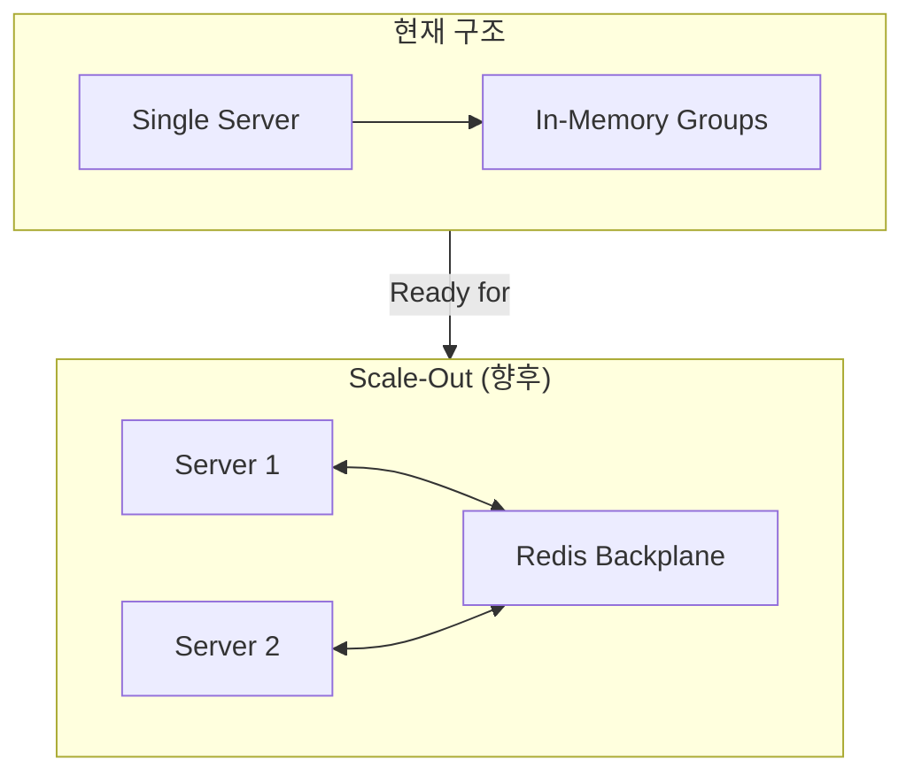

---

## 향후 발전 방향

| 기능 | 설명 | 복잡도 |
|------|------|--------|
| 개인 알림 | 특정 사용자에게만 전송 | 낮음 |
| 알림 UI | 토스트/뱃지 표시 | 중간 |
| 알림 기록 | DB 저장 및 조회 | 중간 |
| Redis Backplane | 다중 서버 지원 | 높음 |
| 오프라인 지원 | 재연결 시 누락 이벤트 전송 | 높음 |

---

## 관련 문서

| 문서 | 경로 |
|------|------|
| 기본 인프라 | `signalr-basic-setup-infrastructure.md` |
| App vs Page Level | `01-app-level-vs-page-level.md` |
| camelCase 직렬화 | `02-camelcase-serialization.md` |
| Frontend Task #56 | `frontend/56-signalr-event-handling/` |

---

## Changelog

| Story | Task | 변경 내용 |
|-------|------|----------|
| #50 | #51 | TaskHub 생성, Program.cs 설정 |
| #50 | #52 | signalRService.ts, BoardPage 연결 |
| #53 | #54 | INotificationService 인터페이스 |
| #53 | #55 | NotificationService, TaskService 연동 |
| #53 | #56 | Frontend Event Handlers, Redux 통합 |
| #53 | - | App-Level 연결, camelCase 수정 |
